# Preference Memory First, LangGraph Second Implementation Plan

> **For agentic workers:** REQUIRED SUB-SKILL: Use superpowers:subagent-driven-development (recommended) or superpowers:executing-plans to implement this plan task-by-task. Steps use checkbox (`- [ ]`) syntax for tracking.

**Goal:** Implement the long-term Preference Memory feedback loop first, then migrate the stabilized video RAG workflow to LangGraph without changing the current test-video parameters or polluting the main library.

**Architecture:** Phase 1 adds candidate, feedback, profile, and rerank services around the existing script pipeline while keeping `preference_memory.enabled=false` by default. Phase 2 introduces LangGraph only after Phase 1 has stable data contracts, real feedback, baseline-vs-memory evaluation, and service boundaries that can be wrapped as graph nodes. LangGraph is used for orchestration, checkpointing, streaming, resume, and human approval gates; it must not become the owner of long-term preference data.

**Tech Stack:** Python 3.11+, FastAPI, Pydantic v2, SQLite/WAL, FAISS, NumPy, Ollama HTTP API, ffmpeg/ffprobe, existing `nomic-embed-text` embeddings, LangGraph Graph API, LangGraph checkpoint persistence, pytest, Docker Compose on WSL2

**Authoritative design:** `docs/superpowers/specs/2026-06-18-rag-observability-workbench-design.md`

**Detailed existing plan to reuse:** `docs/superpowers/plans/2026-06-18-rag-observability-preference-memory-implementation.md`

---

## Global Constraints

1. Do not migrate or write production `data/library.db` while VLM, FAISS rebuild, or full RAG ingest is running.
2. Do not change `scripts/test_video_adaptive.py` sampling, threshold, merge, output-ratio, or output-cap values as part of Preference Memory.
3. The main `media`, `frames`, `annotations`, `vector_refs`, and main FAISS index remain stable unless a user explicitly promotes a candidate.
4. New GIFs from test videos land in candidate tables first. They do not automatically become main-library media.
5. Feedback is append-only. Like, neutral, dislike, quality reject, and skip events must not overwrite historical run candidates.
6. Effective feedback thresholds are cross-video cumulative after deduplication, not per-video counts.
7. `preference_memory.enabled=false` is the default until holdout evaluation passes and the user explicitly publishes a profile version.
8. Preference Memory affects reranking only. It does not affect frame extraction, VLM prompts, local/cloud model routing, GIF export, or FAISS rebuild behavior.
9. LangGraph state stores small IDs and stage metadata only. Large model outputs, frame files, GIF files, vectors, retrieval evidence, and run artifacts stay in SQLite or artifact directories.
10. LangGraph checkpointer storage is separate from `library.db` and `runs.db`. Use `data/langgraph_checkpoints.sqlite` or a test-scoped temporary equivalent.
11. Sensitive or adult-content frames remain local. Cloud API routing is a separate provider decision and must not be introduced by this plan.
12. The current local embedding model remains `nomic-embed-text:latest`; changing embeddings requires a separate full-index migration and A/B plan.

## External References Verified On 2026-06-27

Use official LangGraph documentation when implementing Phase 2:

- [LangGraph overview](https://docs.langchain.com/oss/python/langgraph/overview): LangGraph is low-level orchestration for durable execution, streaming, human-in-the-loop, and persistence.
- [LangGraph persistence](https://docs.langchain.com/oss/python/langgraph/persistence): checkpointers are thread-scoped short-term state; stores are long-term application memory.
- [LangGraph interrupts](https://docs.langchain.com/oss/python/langgraph/interrupts): `interrupt()` pauses graph execution and resumes with a concrete command such as `Command(resume={"approved": True})`; side effects before an interrupt must be idempotent.
- [LangGraph Graph API](https://docs.langchain.com/oss/python/langgraph/graph-api): use `StateGraph`, `START`, `END`, normal edges, and conditional edges for explicit workflow orchestration.

## Required Execution Order

Do not start LangGraph implementation until Phase 1 gates pass. The order is intentional:

```mermaid
flowchart LR
    A["Baseline snapshot"] --> B["Preference Memory schema"]
    B --> C["Candidate materialization"]
    C --> D["Feedback events"]
    D --> E["Profile build and publish"]
    E --> F["Rerank behind feature flag"]
    F --> G["Holdout evaluation"]
    G --> H["Service-boundary cleanup"]
    H --> I["LangGraph graph wrapper"]
    I --> J["LangGraph worker rollout"]
```



## Phase 1 Gates: Preference Memory

| Gate | Required evidence |
|---|---|
| P1-G0 Baseline | Existing tests pass; production DB and FAISS snapshot recorded outside Git |
| P1-G1 Schema | Candidate, vector, event, profile, and current-pointer tables migrate on temporary and copied DBs |
| P1-G2 Feedback | Same candidate can receive like, neutral, dislike events; latest-effective state is deterministic |
| P1-G3 Profile | Same event watermark produces the same immutable profile version and same centroid checksums |
| P1-G4 Rerank | `preference_memory.enabled=false` produces exact baseline ranking; enabled mode records score components |
| P1-G5 Evaluation | Holdout report blocks default enablement when data is insufficient or metrics regress |

## Phase 2 Gates: LangGraph

| Gate | Required evidence |
|---|---|
| L2-G0 Service readiness | Pipeline stages are callable services with typed inputs and no top-level side effects |
| L2-G1 Graph parity | LangGraph disabled and LangGraph enabled produce equivalent candidates on fake inference fixtures |
| L2-G2 Resume | A graph run interrupted or killed after frame analysis resumes without duplicate candidates or duplicate feedback |
| L2-G3 Streaming | Graph stage updates map to existing run events and Web/SSE consumers without schema churn |
| L2-G4 Rollback | Config can switch back to legacy/service orchestrator without schema downgrade |

## Phase 1 File Map

Create:

```text
app/services/preference_schema.py
app/services/scenario.py
app/services/candidates.py
app/services/preference_events.py
app/services/preference_memory.py
app/services/reranker.py
app/services/preference_evaluation.py
app/routers/candidates.py
app/routers/preference.py
scripts/preference_memory.py
scripts/import_adaptive_candidates.py
scripts/evaluate_preference.py
tests/test_candidate_schema.py
tests/test_candidate_materialization.py
tests/test_preference_events.py
tests/test_preference_profiles.py
tests/test_preference_reranker.py
tests/test_preference_evaluation.py
```

Modify:

```text
app/db.py
app/main.py
app/config.py
scripts/test_video_adaptive.py
scripts/pipeline_stage2.py
README.md
docs/runbook-rag-workbench.md
```

Do not modify for Phase 1:

```text
data/library.db
data/library.db-shm
data/library.db-wal
data/*.log
data/faiss/*
```

## Phase 2 File Map

Create:

```text
app/graphs/__init__.py
app/graphs/state.py
app/graphs/checkpoints.py
app/graphs/nodes.py
app/graphs/gif_rag_graph.py
app/graphs/runner.py
app/runs/service_orchestrator.py
scripts/run_langgraph_worker.py
tests/test_langgraph_state.py
tests/test_langgraph_graph.py
tests/test_langgraph_resume.py
tests/test_langgraph_parity.py
```

Modify:

```text
app/config.py
app/runs/pipeline.py
app/runs/worker.py
app/runs/events.py
app/routers/runs.py
pyproject.toml
README.md
docs/runbook-rag-workbench.md
```

## Shared Interfaces

These interfaces define the boundary between Preference Memory and later LangGraph nodes. Implement Phase 1 services with these names so Phase 2 can wrap them directly.

```python
from dataclasses import dataclass
from typing import Literal

Rating = Literal["like", "neutral", "dislike", "quality_reject", "skip"]
CandidateStatus = Literal["candidate", "liked", "disliked", "neutral", "promoted", "rejected", "archived"]

@dataclass(frozen=True)
class MaterializedCandidate:
    candidate_id: str
    source_run_id: str
    source_run_candidate_id: str
    source_video_sha256: str
    start_sec: float
    end_sec: float
    status: CandidateStatus

@dataclass(frozen=True)
class FeedbackEvent:
    event_id: str
    target_type: Literal["media", "candidate_gif"]
    target_id: str
    rating: Rating
    source_video_sha256: str
    created_at: str

@dataclass(frozen=True)
class ProfileBuildResult:
    profile_version: str
    event_watermark: str
    effective_feedback_count: int
    status: Literal["built", "blocked"]
    gate_reasons: list[str]

@dataclass(frozen=True)
class ScoreBreakdown:
    base_rag_similarity: float
    profile_score: float | None
    raw_score: float
    final_score: float
    active_weights: dict[str, float]
    inactive_reasons: dict[str, str]
    preference_profile_version: str | None
```

## Phase 1: Preference Memory First

### Task P1-1: Freeze Baseline And Protect Production Data

**Files:**
- Create: `tests/test_preference_preflight.py`
- Create: `scripts/preference_memory.py`
- Modify: `README.md`
- Modify: `docs/runbook-rag-workbench.md`

**Interfaces:**
- Produces: `scripts/preference_memory.py status --json`
- Produces: a documented operator rule that migrations run only after ingest is stopped

- [ ] **Step 1: Write the failing preflight test**

```python
def test_preference_memory_status_reports_safe_defaults(tmp_path, monkeypatch):
    from scripts.preference_memory import collect_status

    db_path = tmp_path / "library.db"
    index_manifest = tmp_path / "manifest.json"
    index_manifest.write_text('{"embedding_model":"nomic-embed-text:latest","dim":768,"vector_count":0}', encoding="utf-8")

    status = collect_status(library_db_path=db_path, faiss_manifest_path=index_manifest)

    assert status["preference_memory_enabled"] is False
    assert status["embedding_model"] == "nomic-embed-text:latest"
    assert status["embedding_dim"] == 768
    assert status["production_write_allowed"] is False
```

- [ ] **Step 2: Run the test and confirm failure**

Run:

```powershell
python -m pytest tests/test_preference_preflight.py -v
```

Expected: FAIL because `scripts.preference_memory.collect_status` does not exist.

- [ ] **Step 3: Implement the minimal status command**

Create `scripts/preference_memory.py` with:

```python
from __future__ import annotations

import argparse
import json
from pathlib import Path
from typing import Any


def collect_status(*, library_db_path: Path, faiss_manifest_path: Path) -> dict[str, Any]:
    manifest = json.loads(faiss_manifest_path.read_text(encoding="utf-8"))
    return {
        "library_db_path": str(library_db_path),
        "library_db_exists": library_db_path.exists(),
        "preference_memory_enabled": False,
        "production_write_allowed": False,
        "embedding_model": manifest["embedding_model"],
        "embedding_dim": int(manifest["dim"]),
        "vector_count": int(manifest.get("vector_count", 0)),
    }


def main() -> int:
    parser = argparse.ArgumentParser()
    sub = parser.add_subparsers(dest="command", required=True)
    status = sub.add_parser("status")
    status.add_argument("--library-db", default="data/library.db")
    status.add_argument("--faiss-manifest", default="data/faiss/manifest.json")
    status.add_argument("--json", action="store_true")
    args = parser.parse_args()

    payload = collect_status(
        library_db_path=Path(args.library_db),
        faiss_manifest_path=Path(args.faiss_manifest),
    )
    print(json.dumps(payload, ensure_ascii=False, indent=2 if args.json else None))
    return 0


if __name__ == "__main__":
    raise SystemExit(main())
```

- [ ] **Step 4: Run tests**

Run:

```powershell
python -m pytest tests/test_preference_preflight.py -v
```

Expected: PASS.

- [ ] **Step 5: Document baseline protection**

Add to `docs/runbook-rag-workbench.md`:

```markdown
## Preference Memory Migration Safety

Before running Preference Memory migrations on the production database:

1. Stop VLM loop, stage2 synthesis, FAISS rebuild, and adaptive test workers.
2. Confirm `data/library.db-wal` is no longer growing.
3. Back up `data/library.db`, `data/faiss/`, and current model configuration outside Git.
4. Run `python scripts/preference_memory.py status --json`.
5. Proceed only when the operator has confirmed the active ingest run is complete.
```

- [ ] **Step 6: Commit**

```powershell
git add scripts/preference_memory.py tests/test_preference_preflight.py README.md docs/runbook-rag-workbench.md
git commit -m "docs: add preference memory preflight safety"
```

### Task P1-2: Add Candidate And Preference Tables

**Files:**
- Create: `app/services/preference_schema.py`
- Create: `tests/test_candidate_schema.py`
- Modify: `app/db.py`

**Interfaces:**
- Produces: `preference_schema.apply_preference_schema(conn: sqlite3.Connection) -> None`
- Produces: tables `candidate_gifs`, `candidate_vectors`, `preference_events`, `preference_profile_builds`, `preference_profiles`, `preference_profile_current`

- [ ] **Step 1: Write schema tests**

```python
import sqlite3


def table_names(conn: sqlite3.Connection) -> set[str]:
    rows = conn.execute("SELECT name FROM sqlite_master WHERE type='table'").fetchall()
    return {row[0] for row in rows}


def test_preference_schema_creates_required_tables():
    from app.services.preference_schema import apply_preference_schema

    conn = sqlite3.connect(":memory:")
    apply_preference_schema(conn)

    assert {
        "candidate_gifs",
        "candidate_vectors",
        "preference_events",
        "preference_profile_builds",
        "preference_profiles",
        "preference_profile_current",
    }.issubset(table_names(conn))


def test_preference_schema_is_idempotent():
    from app.services.preference_schema import apply_preference_schema

    conn = sqlite3.connect(":memory:")
    apply_preference_schema(conn)
    apply_preference_schema(conn)

    assert conn.execute("PRAGMA integrity_check").fetchone()[0] == "ok"
```

- [ ] **Step 2: Run schema tests and confirm failure**

Run:

```powershell
python -m pytest tests/test_candidate_schema.py -v
```

Expected: FAIL because `app.services.preference_schema` does not exist.

- [ ] **Step 3: Implement schema migration**

Create `app/services/preference_schema.py` with SQL matching the design document. Minimum required DDL:

```python
from __future__ import annotations

import sqlite3


def apply_preference_schema(conn: sqlite3.Connection) -> None:
    conn.executescript(
        """
        CREATE TABLE IF NOT EXISTS candidate_gifs (
            candidate_id TEXT PRIMARY KEY,
            source_run_id TEXT NOT NULL,
            source_run_candidate_id TEXT NOT NULL,
            source_video_sha256 TEXT NOT NULL,
            source_video_path TEXT NOT NULL,
            start_sec REAL NOT NULL,
            end_sec REAL NOT NULL,
            artifact_path TEXT,
            preview_path TEXT,
            vlm_summary_json TEXT NOT NULL DEFAULT '{}',
            tags_json TEXT NOT NULL DEFAULT '[]',
            scenario_keys_json TEXT NOT NULL DEFAULT '[]',
            base_rag_similarity REAL,
            profile_score REAL,
            final_score REAL,
            score_profile_version TEXT,
            status TEXT NOT NULL DEFAULT 'candidate'
                CHECK(status IN ('candidate','liked','disliked','neutral','promoted','rejected','archived')),
            promoted_media_id INTEGER,
            created_at TEXT NOT NULL DEFAULT CURRENT_TIMESTAMP,
            updated_at TEXT NOT NULL DEFAULT CURRENT_TIMESTAMP,
            UNIQUE(source_run_id, source_run_candidate_id)
        );

        CREATE TABLE IF NOT EXISTS candidate_vectors (
            candidate_id TEXT NOT NULL,
            vector_type TEXT NOT NULL,
            embedding_model TEXT NOT NULL,
            embedding_dim INTEGER NOT NULL,
            vector_blob BLOB NOT NULL,
            normalized INTEGER NOT NULL DEFAULT 1,
            created_at TEXT NOT NULL DEFAULT CURRENT_TIMESTAMP,
            PRIMARY KEY(candidate_id, vector_type, embedding_model),
            FOREIGN KEY(candidate_id) REFERENCES candidate_gifs(candidate_id)
        );

        CREATE TABLE IF NOT EXISTS preference_events (
            event_id TEXT PRIMARY KEY,
            target_type TEXT NOT NULL CHECK(target_type IN ('media','candidate_gif')),
            target_id TEXT NOT NULL,
            rating TEXT NOT NULL CHECK(rating IN ('like','neutral','dislike','quality_reject','skip')),
            source_video_sha256 TEXT NOT NULL,
            scenario_keys_json TEXT NOT NULL DEFAULT '[]',
            corrected_tags_json TEXT,
            note TEXT,
            created_at TEXT NOT NULL DEFAULT CURRENT_TIMESTAMP
        );

        CREATE TABLE IF NOT EXISTS preference_profile_builds (
            profile_version TEXT PRIMARY KEY,
            event_watermark TEXT NOT NULL,
            embedding_model TEXT NOT NULL,
            embedding_dim INTEGER NOT NULL,
            effective_feedback_count INTEGER NOT NULL,
            source_video_count INTEGER NOT NULL,
            config_json TEXT NOT NULL,
            status TEXT NOT NULL CHECK(status IN ('building','completed','blocked','failed')),
            gate_reasons_json TEXT NOT NULL DEFAULT '[]',
            created_at TEXT NOT NULL DEFAULT CURRENT_TIMESTAMP,
            completed_at TEXT
        );

        CREATE TABLE IF NOT EXISTS preference_profiles (
            profile_id TEXT PRIMARY KEY,
            profile_version TEXT NOT NULL,
            scope TEXT NOT NULL CHECK(scope IN ('global','scenario')),
            scenario_key TEXT,
            like_count INTEGER NOT NULL,
            dislike_count INTEGER NOT NULL,
            neutral_count INTEGER NOT NULL,
            confidence REAL NOT NULL,
            liked_centroid_blob BLOB,
            disliked_centroid_blob BLOB,
            tag_weights_json TEXT NOT NULL DEFAULT '{}',
            created_at TEXT NOT NULL DEFAULT CURRENT_TIMESTAMP,
            FOREIGN KEY(profile_version) REFERENCES preference_profile_builds(profile_version),
            UNIQUE(profile_version, scope, scenario_key)
        );

        CREATE TABLE IF NOT EXISTS preference_profile_current (
            slot TEXT PRIMARY KEY CHECK(slot = 'current'),
            profile_version TEXT NOT NULL,
            published_at TEXT NOT NULL DEFAULT CURRENT_TIMESTAMP,
            FOREIGN KEY(profile_version) REFERENCES preference_profile_builds(profile_version)
        );

        CREATE INDEX IF NOT EXISTS idx_candidate_gifs_status_score
            ON candidate_gifs(status, final_score);
        CREATE INDEX IF NOT EXISTS idx_candidate_gifs_source
            ON candidate_gifs(source_video_sha256, source_run_id);
        CREATE INDEX IF NOT EXISTS idx_preference_events_target
            ON preference_events(target_type, target_id, created_at);
        CREATE INDEX IF NOT EXISTS idx_preference_events_video
            ON preference_events(source_video_sha256, created_at);
        """
    )
    conn.commit()
```

- [ ] **Step 4: Wire schema hook into test database initialization**

Modify `app/db.py` so application startup can call `apply_preference_schema(conn)` after existing tables are initialized. Keep production migrations operator-triggered, not automatic during active ingest.

- [ ] **Step 5: Run schema tests**

Run:

```powershell
python -m pytest tests/test_candidate_schema.py -v
```

Expected: PASS.

- [ ] **Step 6: Commit**

```powershell
git add app/db.py app/services/preference_schema.py tests/test_candidate_schema.py
git commit -m "feat: add preference memory schema"
```

### Task P1-3: Materialize Run Candidates Into Long-Term Candidates

**Files:**
- Create: `app/services/scenario.py`
- Create: `app/services/candidates.py`
- Create: `tests/test_candidate_materialization.py`
- Create: `scripts/import_adaptive_candidates.py`

**Interfaces:**
- Produces: `CandidateService.materialize_run_candidate(run_id: str, run_candidate: dict) -> MaterializedCandidate`
- Produces: deterministic `candidate_id`
- Consumes: adaptive output JSON from `data/adaptive_test_result.json` and future `rag_run_candidates`

- [ ] **Step 1: Write materialization tests**

```python
import sqlite3


def test_materialize_run_candidate_is_idempotent(tmp_path):
    from app.services.preference_schema import apply_preference_schema
    from app.services.candidates import CandidateService

    conn = sqlite3.connect(":memory:")
    apply_preference_schema(conn)
    service = CandidateService(conn)
    payload = {
        "run_candidate_id": "clip-001",
        "source_video_sha256": "sha256-video",
        "source_video_path": "D:/videos/sample.mp4",
        "start_sec": 12.0,
        "end_sec": 16.5,
        "artifact_path": "data/exports/sample.gif",
        "preview_path": "data/exports/sample.gif",
        "vlm_summary": {"emotion": "joy"},
        "tags": ["smile", "closeup"],
        "base_rag_similarity": 0.71,
        "final_score": 0.71,
    }

    first = service.materialize_run_candidate("run-1", payload)
    second = service.materialize_run_candidate("run-1", payload)

    assert first.candidate_id == second.candidate_id
    assert first.status == "candidate"
    assert conn.execute("SELECT COUNT(*) FROM candidate_gifs").fetchone()[0] == 1
```

- [ ] **Step 2: Run test and confirm failure**

Run:

```powershell
python -m pytest tests/test_candidate_materialization.py -v
```

Expected: FAIL because `CandidateService` does not exist.

- [ ] **Step 3: Implement scenario normalization**

`app/services/scenario.py` must expose:

```python
from __future__ import annotations

import json
from typing import Iterable


def normalize_scenario_keys(*, emotion: str | None, scene_type: str | None, tags: Iterable[str]) -> list[str]:
    keys: set[str] = set()
    if emotion:
        keys.add(f"emotion:{emotion.strip().lower()}")
    if scene_type:
        keys.add(f"scene:{scene_type.strip().lower()}")
    for tag in tags:
        clean = tag.strip().lower()
        if clean:
            keys.add(f"tag:{clean}")
    return sorted(keys)


def json_dumps(value: object) -> str:
    return json.dumps(value, ensure_ascii=False, sort_keys=True)
```

- [ ] **Step 4: Implement candidate service**

`CandidateService.materialize_run_candidate()` must:

1. Build `candidate_id` from `source_video_sha256`, `start_sec`, `end_sec`, and `run_candidate_id`.
2. Insert into `candidate_gifs` with `INSERT OR IGNORE`.
3. Return the existing row on repeated calls.
4. Never insert into `media`, `frames`, `annotations`, or `vector_refs`.

- [ ] **Step 5: Add dry-run importer**

`scripts/import_adaptive_candidates.py` must support:

```powershell
python scripts/import_adaptive_candidates.py --input data/adaptive_test_result.json --dry-run
python scripts/import_adaptive_candidates.py --input data/adaptive_test_result.json --apply
```

Dry run prints candidate count, source video hash when present, and `NO WRITES PERFORMED`.

- [ ] **Step 6: Run tests**

Run:

```powershell
python -m pytest tests/test_candidate_materialization.py -v
```

Expected: PASS.

- [ ] **Step 7: Commit**

```powershell
git add app/services/scenario.py app/services/candidates.py scripts/import_adaptive_candidates.py tests/test_candidate_materialization.py
git commit -m "feat: materialize run candidates for preference memory"
```

### Task P1-4: Record Append-Only Feedback Events

**Files:**
- Create: `app/services/preference_events.py`
- Create: `tests/test_preference_events.py`
- Modify: `app/services/candidates.py`
- Create: `app/routers/candidates.py`

**Interfaces:**
- Produces: `PreferenceEventService.record_feedback(target_type: str, target_id: str, rating: str, source_video_sha256: str, scenario_keys: list[str]) -> FeedbackEvent`
- Produces: `PreferenceEventService.latest_effective_ratings() -> dict[str, FeedbackEvent]`
- Produces: `POST /api/candidates/{candidate_id}/feedback`

- [ ] **Step 1: Write event tests**

```python
import sqlite3


def test_feedback_events_are_append_only_and_latest_effective():
    from app.services.preference_schema import apply_preference_schema
    from app.services.preference_events import PreferenceEventService

    conn = sqlite3.connect(":memory:")
    apply_preference_schema(conn)
    service = PreferenceEventService(conn)

    first = service.record_feedback(
        target_type="candidate_gif",
        target_id="cand-1",
        rating="like",
        source_video_sha256="video-1",
        scenario_keys=["tag:smile"],
    )
    second = service.record_feedback(
        target_type="candidate_gif",
        target_id="cand-1",
        rating="dislike",
        source_video_sha256="video-1",
        scenario_keys=["tag:smile"],
    )

    latest = service.latest_effective_ratings()

    assert first.event_id != second.event_id
    assert conn.execute("SELECT COUNT(*) FROM preference_events").fetchone()[0] == 2
    assert latest["candidate_gif:cand-1"].rating == "dislike"
```

- [ ] **Step 2: Run event tests and confirm failure**

Run:

```powershell
python -m pytest tests/test_preference_events.py -v
```

Expected: FAIL because `PreferenceEventService` does not exist.

- [ ] **Step 3: Implement event service**

Rules:

1. Validate `rating` against `like`, `neutral`, `dislike`, `quality_reject`, `skip`.
2. Generate a unique event ID using a stable prefix plus UUID.
3. Insert one row per feedback action.
4. Update `candidate_gifs.status` only for `like`, `neutral`, `dislike`, and `quality_reject`.
5. Do not count `neutral`, `skip`, and `quality_reject` as effective weight contributors.

- [ ] **Step 4: Implement feedback API**

`POST /api/candidates/{candidate_id}/feedback` request:

```json
{
  "rating": "like",
  "note": "optional human note"
}
```

Response:

```json
{
  "event_id": "prefevt_01HYEXAMPLE0001",
  "candidate_id": "cand_01HYEXAMPLE0001",
  "rating": "like",
  "status": "liked"
}
```

- [ ] **Step 5: Run tests**

Run:

```powershell
python -m pytest tests/test_preference_events.py -v
```

Expected: PASS.

- [ ] **Step 6: Commit**

```powershell
git add app/services/preference_events.py app/services/candidates.py app/routers/candidates.py tests/test_preference_events.py
git commit -m "feat: record append-only candidate feedback"
```

### Task P1-5: Build Immutable Global And Scenario Profiles

**Files:**
- Create: `app/services/preference_memory.py`
- Create: `tests/test_preference_profiles.py`
- Create: `app/routers/preference.py`
- Modify: `scripts/preference_memory.py`

**Interfaces:**
- Produces: `PreferenceMemoryService.build_profile(dry_run: bool = False) -> ProfileBuildResult`
- Produces: `PreferenceMemoryService.publish(profile_version: str) -> None`
- Produces: `GET /api/preference/profiles`
- Produces: `POST /api/preference/profiles/build`
- Produces: `POST /api/preference/profiles/{profile_version}/publish`

- [ ] **Step 1: Write deterministic profile tests**

```python
def test_profile_build_blocks_when_effective_feedback_is_insufficient(profile_fixture):
    result = profile_fixture.memory.build_profile(dry_run=False)

    assert result.status == "blocked"
    assert "effective_feedback_count_lt_30" in result.gate_reasons


def test_profile_build_is_deterministic(profile_fixture_with_enough_feedback):
    first = profile_fixture_with_enough_feedback.memory.build_profile(dry_run=False)
    second = profile_fixture_with_enough_feedback.memory.build_profile(dry_run=False)

    assert first.profile_version == second.profile_version
    assert first.status == "built"
```

- [ ] **Step 2: Run tests and confirm failure**

Run:

```powershell
python -m pytest tests/test_preference_profiles.py -v
```

Expected: FAIL because `PreferenceMemoryService` does not exist.

- [ ] **Step 3: Implement profile gates**

Minimum build gates:

```text
effective_feedback_count >= 30
like_count >= 15
dislike_count >= 10
source_video_count >= 3
max_single_video_share <= 0.40
embedding_model == nomic-embed-text:latest
embedding_dim == 768
```

When a gate fails:

1. Insert or return a `preference_profile_builds` row with `status='blocked'`.
2. Store exact gate reasons in `gate_reasons_json`.
3. Do not update `preference_profile_current`.

- [ ] **Step 4: Implement centroid and profile versioning**

Rules:

1. Use only latest-effective like and dislike events.
2. Exclude neutral, skip, quality reject, duplicate candidates, and missing vectors.
3. Compute global liked and disliked centroids from normalized 768-d vectors.
4. Compute scenario centroids only when that scenario has at least 5 effective feedback events and confidence at least 0.25.
5. Compute `profile_version` from embedding model, embedding dim, event watermark, build config JSON, and sorted effective target IDs.
6. Completed profile versions are immutable.

- [ ] **Step 5: Implement manual publish**

Publishing a profile:

1. Requires `preference_profile_builds.status='completed'`.
2. Replaces the single `preference_profile_current` row.
3. Does not change existing run rows or historical candidate scores.
4. Returns the current version after commit.

- [ ] **Step 6: Run tests**

Run:

```powershell
python -m pytest tests/test_preference_profiles.py -v
```

Expected: PASS.

- [ ] **Step 7: Commit**

```powershell
git add app/services/preference_memory.py app/routers/preference.py scripts/preference_memory.py tests/test_preference_profiles.py
git commit -m "feat: build immutable preference profiles"
```

### Task P1-6: Add Availability-Aware Reranking Behind A Feature Flag

**Files:**
- Create: `app/services/reranker.py`
- Create: `tests/test_preference_reranker.py`
- Modify: `scripts/test_video_adaptive.py`
- Modify: `scripts/pipeline_stage2.py`
- Modify: `app/config.py`

**Interfaces:**
- Produces: `PreferenceReranker.score(candidate_vector, base_rag_similarity, scenario_keys, profile_version) -> ScoreBreakdown`
- Consumes: `preference_memory.enabled`
- Consumes: `preference_profile_current`

- [ ] **Step 1: Write baseline-equivalence test**

```python
def test_reranker_disabled_returns_baseline_score(reranker_fixture):
    score = reranker_fixture.reranker.score(
        candidate_vector=reranker_fixture.vector,
        base_rag_similarity=0.62,
        scenario_keys=["tag:smile"],
        profile_version=None,
        enabled=False,
    )

    assert score.base_rag_similarity == 0.62
    assert score.profile_score is None
    assert score.raw_score == 0.62
    assert score.final_score == 0.62
    assert score.preference_profile_version is None
```

- [ ] **Step 2: Write enabled scoring test**

```python
def test_reranker_enabled_records_components(reranker_fixture_with_profile):
    score = reranker_fixture_with_profile.reranker.score(
        candidate_vector=reranker_fixture_with_profile.like_aligned_vector,
        base_rag_similarity=0.50,
        scenario_keys=["tag:smile"],
        profile_version=reranker_fixture_with_profile.profile_version,
        enabled=True,
    )

    assert score.preference_profile_version == reranker_fixture_with_profile.profile_version
    assert score.profile_score is not None
    assert "base_rag_similarity" in score.active_weights
    assert score.final_score > 0.50
```

- [ ] **Step 3: Run tests and confirm failure**

Run:

```powershell
python -m pytest tests/test_preference_reranker.py -v
```

Expected: FAIL because `PreferenceReranker` does not exist.

- [ ] **Step 4: Implement score formula**

Use this first-version formula:

```text
Preference Memory disabled:
  final_score = base_rag_similarity

Preference Memory enabled:
  raw_score =
    0.55 * base_rag_similarity
  + 0.25 * global_like_similarity
  + 0.15 * scenario_like_similarity
  - 0.20 * global_dislike_similarity

  final_score = clamp(raw_score, 0.0, 1.0)
```

Rules:

1. If a component is unavailable, remove its weight and renormalize available positive weights.
2. Record unavailable components in `inactive_reasons`.
3. Use a fixed `profile_version` resolved at run creation time.
4. Do not call `current_profile()` after a run has started.
5. Store `ScoreBreakdown` JSON on the run candidate or candidate row.

- [ ] **Step 5: Wire reranker without changing output volume**

In `scripts/test_video_adaptive.py`, keep the current sampling and export constants untouched. Add only an optional rerank call after the existing base candidate score is computed. When disabled, the sorted output must be byte-for-byte equivalent for candidate IDs and rank order.

- [ ] **Step 6: Run focused tests**

Run:

```powershell
python -m pytest tests/test_preference_reranker.py tests/test_candidate_materialization.py tests/test_preference_events.py -v
```

Expected: PASS.

- [ ] **Step 7: Commit**

```powershell
git add app/services/reranker.py app/config.py scripts/test_video_adaptive.py scripts/pipeline_stage2.py tests/test_preference_reranker.py
git commit -m "feat: add preference reranking behind feature flag"
```

### Task P1-7: Add Holdout Evaluation And Manual Enablement

**Files:**
- Create: `app/services/preference_evaluation.py`
- Create: `tests/test_preference_evaluation.py`
- Create: `scripts/evaluate_preference.py`
- Modify: `app/routers/preference.py`
- Modify: `README.md`

**Interfaces:**
- Produces: `PreferenceEvaluationService.evaluate(profile_version: str, holdout_path: Path) -> dict`
- Produces: `python scripts/evaluate_preference.py --profile-version <version> --holdout <jsonl>`
- Produces: API response fields `can_publish`, `gate_reasons`, `like_at_20`, `dislike_at_20`, `ndcg_at_20`

- [ ] **Step 1: Write evaluation gate tests**

```python
def test_evaluation_blocks_insufficient_holdout(evaluation_fixture):
    report = evaluation_fixture.evaluate(judgment_count=12)

    assert report["can_publish"] is False
    assert "holdout_judgment_count_lt_30" in report["gate_reasons"]


def test_evaluation_rejects_profile_source_leakage(evaluation_fixture):
    report = evaluation_fixture.evaluate_with_source_overlap()

    assert report["can_publish"] is False
    assert "profile_source_overlap" in report["gate_reasons"]
```

- [ ] **Step 2: Run tests and confirm failure**

Run:

```powershell
python -m pytest tests/test_preference_evaluation.py -v
```

Expected: FAIL because `PreferenceEvaluationService` does not exist.

- [ ] **Step 3: Implement metrics**

Definitions:

```text
Like@20 = holdout liked candidates in top 20 / total holdout liked candidates
Dislike@20 = disliked candidates in top 20 / 20
NDCG@20 gain values: like=3, neutral=1, dislike=0
```

Gate behavior:

1. Fewer than 30 holdout judgments blocks publish.
2. Source videos used for profile training cannot appear in holdout.
3. A candidate with `quality_reject` is excluded from positive metrics.
4. A failed gate leaves `preference_memory.enabled=false`.

- [ ] **Step 4: Add manual enablement**

Manual enablement requires two distinct user actions:

1. Build candidate profile version.
2. Publish completed profile version.

The build action must not silently publish. The publish action must show gate report fields in the API response.

- [ ] **Step 5: Run tests**

Run:

```powershell
python -m pytest tests/test_preference_evaluation.py tests/test_preference_profiles.py tests/test_preference_reranker.py -v
```

Expected: PASS.

- [ ] **Step 6: Commit**

```powershell
git add app/services/preference_evaluation.py app/routers/preference.py scripts/evaluate_preference.py tests/test_preference_evaluation.py README.md
git commit -m "feat: gate preference memory publishing with holdout evaluation"
```

## Phase 1 Completion Checklist

- [ ] `python -m pytest tests/test_candidate_schema.py tests/test_candidate_materialization.py tests/test_preference_events.py tests/test_preference_profiles.py tests/test_preference_reranker.py tests/test_preference_evaluation.py -v` passes.
- [ ] `python scripts/preference_memory.py status --json` reports `preference_memory_enabled=false` by default.
- [ ] Dry-run import from `data/adaptive_test_result.json` performs no writes.
- [ ] Applying feedback creates events but does not change main `media` count.
- [ ] Building a blocked profile records gate reasons and does not publish.
- [ ] Publishing a completed profile requires an explicit publish call.
- [ ] Running a test video with Preference Memory disabled keeps existing output parameters and baseline ranking.

## Phase 2: LangGraph After Preference Memory

Start Phase 2 only after Phase 1 completion checklist passes and at least one baseline-vs-memory comparison has been recorded. LangGraph should wrap stable services; it should not force a rewrite of candidate, feedback, profile, or rerank logic.

### Task L2-1: Extract Script Logic Into Side-Effect-Controlled Services

**Files:**
- Create: `app/runs/service_orchestrator.py`
- Create: `tests/test_service_orchestrator.py`
- Modify: `scripts/test_video_adaptive.py`
- Modify: `scripts/pipeline_stage2.py`
- Modify: `scripts/vlm_loop.py`

**Interfaces:**
- Produces: `ServiceOrchestrator.run(request: RunRequest) -> RunResult`
- Produces: stage methods usable by LangGraph nodes:
  - `prepare_run`
  - `extract_frames`
  - `analyze_frames`
  - `retrieve_evidence`
  - `merge_candidates`
  - `score_candidates`
  - `export_candidates`
  - `finalize_run`

- [ ] **Step 1: Write parity test for service orchestrator**

```python
def test_service_orchestrator_preserves_disabled_memory_behavior(fake_video_fixture):
    from app.runs.service_orchestrator import ServiceOrchestrator, RunRequest

    orchestrator = ServiceOrchestrator(fake_video_fixture.dependencies)
    result = orchestrator.run(
        RunRequest(
            source_video_path=fake_video_fixture.video_path,
            preference_memory_enabled=False,
            output_ratio=1.0,
            max_output=0,
        )
    )

    assert result.preference_profile_version is None
    assert [c.rank for c in result.candidates] == list(range(1, len(result.candidates) + 1))
    assert result.used_legacy_export_parameters is True
```

- [ ] **Step 2: Run test and confirm failure**

Run:

```powershell
python -m pytest tests/test_service_orchestrator.py -v
```

Expected: FAIL because `ServiceOrchestrator` does not exist.

- [ ] **Step 3: Move top-level script work behind functions**

Rules:

1. Importing `scripts/pipeline_stage2.py` must not start synthesis or FAISS rebuild.
2. Importing `scripts/vlm_loop.py` must not start VLM processing.
3. CLI entrypoints call service methods under `if __name__ == "__main__"`.
4. Existing command behavior remains available.

- [ ] **Step 4: Implement service orchestrator**

`ServiceOrchestrator` calls existing logic in the same order as the current scripts. It returns typed stage outputs and writes the same artifacts through explicit repository or artifact writer calls.

- [ ] **Step 5: Run focused parity tests**

Run:

```powershell
python -m pytest tests/test_service_orchestrator.py tests/test_preference_reranker.py -v
```

Expected: PASS.

- [ ] **Step 6: Commit**

```powershell
git add app/runs/service_orchestrator.py scripts/test_video_adaptive.py scripts/pipeline_stage2.py scripts/vlm_loop.py tests/test_service_orchestrator.py
git commit -m "refactor: extract test video flow into services"
```

### Task L2-2: Add LangGraph Dependencies And Checkpoint Boundary

**Files:**
- Create: `app/graphs/checkpoints.py`
- Create: `tests/test_langgraph_state.py`
- Modify: `pyproject.toml`
- Modify: `app/config.py`

**Interfaces:**
- Produces: `get_graph_checkpointer(path: Path)`
- Produces: config field `orchestrator.mode` with values `service` and `langgraph`
- Produces: config field `langgraph.checkpoint_path`

- [ ] **Step 1: Add dependency test**

```python
def test_langgraph_imports_are_available():
    import langgraph
    from langgraph.graph import StateGraph, START, END

    assert langgraph is not None
    assert StateGraph is not None
    assert START is not None
    assert END is not None
```

- [ ] **Step 2: Add dependencies**

Add to `pyproject.toml`:

```toml
dependencies = [
  "langgraph",
  "langgraph-checkpoint-sqlite",
]
```

If the project already has a dependency list, add these entries to the existing list and keep the current package manager.

- [ ] **Step 3: Install dependencies**

Run:

```powershell
python -m pip install -e .
```

Expected: installation succeeds and `python -m pytest tests/test_langgraph_state.py -v` can import LangGraph.

- [ ] **Step 4: Implement checkpoint helper**

`app/graphs/checkpoints.py` must:

1. Create parent directories for `data/langgraph_checkpoints.sqlite`.
2. Use SQLite checkpoint persistence for local execution.
3. Never reuse `data/library.db` or `runs.db` as the LangGraph checkpointer.
4. Allow tests to pass a temporary checkpoint path.

- [ ] **Step 5: Run tests**

Run:

```powershell
python -m pytest tests/test_langgraph_state.py -v
```

Expected: PASS.

- [ ] **Step 6: Commit**

```powershell
git add pyproject.toml app/config.py app/graphs/checkpoints.py tests/test_langgraph_state.py
git commit -m "feat: add langgraph checkpoint boundary"
```

### Task L2-3: Define Minimal Graph State

**Files:**
- Create: `app/graphs/state.py`
- Modify: `tests/test_langgraph_state.py`

**Interfaces:**
- Produces: `GifRagState`
- Produces: `RunStage`
- Produces: `GraphError`

- [ ] **Step 1: Add state shape test**

```python
def test_graph_state_keeps_large_payloads_out():
    from app.graphs.state import initial_state

    state = initial_state(
        run_id="run-1",
        source_video_path="D:/videos/sample.mp4",
        source_video_sha256="sha256-video",
        preference_memory_enabled=False,
        preference_profile_version=None,
    )

    assert state["run_id"] == "run-1"
    assert "raw_frames" not in state
    assert "raw_vlm_responses" not in state
    assert "vectors" not in state
```

- [ ] **Step 2: Implement state module**

Use this state shape:

```python
from __future__ import annotations

from typing import Literal, TypedDict

RunStage = Literal[
    "created",
    "prepared",
    "frames_extracted",
    "frames_analyzed",
    "evidence_retrieved",
    "candidates_merged",
    "candidates_scored",
    "candidates_exported",
    "completed",
    "failed",
]


class GraphError(TypedDict):
    stage: RunStage
    message: str
    retryable: bool


class GifRagState(TypedDict, total=False):
    run_id: str
    source_video_path: str
    source_video_sha256: str
    stage: RunStage
    preference_memory_enabled: bool
    preference_profile_version: str | None
    frame_batch_ids: list[str]
    evidence_batch_ids: list[str]
    run_candidate_ids: list[str]
    exported_candidate_ids: list[str]
    error: GraphError


def initial_state(
    *,
    run_id: str,
    source_video_path: str,
    source_video_sha256: str,
    preference_memory_enabled: bool,
    preference_profile_version: str | None,
) -> GifRagState:
    return {
        "run_id": run_id,
        "source_video_path": source_video_path,
        "source_video_sha256": source_video_sha256,
        "stage": "created",
        "preference_memory_enabled": preference_memory_enabled,
        "preference_profile_version": preference_profile_version,
        "frame_batch_ids": [],
        "evidence_batch_ids": [],
        "run_candidate_ids": [],
        "exported_candidate_ids": [],
    }
```

- [ ] **Step 3: Run state tests**

Run:

```powershell
python -m pytest tests/test_langgraph_state.py -v
```

Expected: PASS.

- [ ] **Step 4: Commit**

```powershell
git add app/graphs/state.py tests/test_langgraph_state.py
git commit -m "feat: define gif rag graph state"
```

### Task L2-4: Wrap Stable Services As Graph Nodes

**Files:**
- Create: `app/graphs/nodes.py`
- Create: `tests/test_langgraph_graph.py`

**Interfaces:**
- Produces node functions:
  - `prepare_run_node(state: GifRagState, deps: GraphDependencies) -> dict`
  - `extract_frames_node(state: GifRagState, deps: GraphDependencies) -> dict`
  - `analyze_frames_node(state: GifRagState, deps: GraphDependencies) -> dict`
  - `retrieve_evidence_node(state: GifRagState, deps: GraphDependencies) -> dict`
  - `merge_candidates_node(state: GifRagState, deps: GraphDependencies) -> dict`
  - `score_candidates_node(state: GifRagState, deps: GraphDependencies) -> dict`
  - `export_candidates_node(state: GifRagState, deps: GraphDependencies) -> dict`
  - `finalize_run_node(state: GifRagState, deps: GraphDependencies) -> dict`

- [ ] **Step 1: Write node test**

```python
def test_prepare_run_node_updates_stage(fake_graph_dependencies):
    from app.graphs.state import initial_state
    from app.graphs.nodes import prepare_run_node

    state = initial_state(
        run_id="run-1",
        source_video_path="D:/videos/sample.mp4",
        source_video_sha256="sha256-video",
        preference_memory_enabled=False,
        preference_profile_version=None,
    )

    update = prepare_run_node(state, fake_graph_dependencies)

    assert update["stage"] == "prepared"
```

- [ ] **Step 2: Run node tests and confirm failure**

Run:

```powershell
python -m pytest tests/test_langgraph_graph.py -v
```

Expected: FAIL because graph nodes do not exist.

- [ ] **Step 3: Implement node wrappers**

Rules:

1. Nodes call `ServiceOrchestrator` stage methods.
2. Nodes return partial state updates and do not mutate `state` in place.
3. Nodes write run events through the existing run event service.
4. Nodes are idempotent when re-executed after a checkpoint resume.
5. Nodes store artifact IDs, not raw artifact payloads.

- [ ] **Step 4: Run node tests**

Run:

```powershell
python -m pytest tests/test_langgraph_graph.py -v
```

Expected: PASS.

- [ ] **Step 5: Commit**

```powershell
git add app/graphs/nodes.py tests/test_langgraph_graph.py
git commit -m "feat: wrap gif rag services as graph nodes"
```

### Task L2-5: Build The Gif RAG StateGraph

**Files:**
- Create: `app/graphs/gif_rag_graph.py`
- Modify: `tests/test_langgraph_graph.py`

**Interfaces:**
- Produces: `build_gif_rag_graph(deps: GraphDependencies, checkpointer) -> CompiledStateGraph`

- [ ] **Step 1: Write graph completion test**

```python
def test_graph_runs_to_completion_with_fake_dependencies(fake_graph_dependencies, temp_checkpointer):
    from app.graphs.gif_rag_graph import build_gif_rag_graph
    from app.graphs.state import initial_state

    graph = build_gif_rag_graph(fake_graph_dependencies, temp_checkpointer)
    result = graph.invoke(
        initial_state(
            run_id="run-1",
            source_video_path="D:/videos/sample.mp4",
            source_video_sha256="sha256-video",
            preference_memory_enabled=False,
            preference_profile_version=None,
        ),
        config={"configurable": {"thread_id": "run-1"}},
    )

    assert result["stage"] == "completed"
    assert result["preference_profile_version"] is None
```

- [ ] **Step 2: Run graph test and confirm failure**

Run:

```powershell
python -m pytest tests/test_langgraph_graph.py::test_graph_runs_to_completion_with_fake_dependencies -v
```

Expected: FAIL because `build_gif_rag_graph` does not exist.

- [ ] **Step 3: Implement graph**

Use Graph API with explicit edges:

```python
from __future__ import annotations

from langgraph.graph import END, START, StateGraph

from app.graphs.state import GifRagState


def build_gif_rag_graph(deps, checkpointer):
    builder = StateGraph(GifRagState)
    builder.add_node("prepare_run", lambda state: deps.nodes.prepare_run(state))
    builder.add_node("extract_frames", lambda state: deps.nodes.extract_frames(state))
    builder.add_node("analyze_frames", lambda state: deps.nodes.analyze_frames(state))
    builder.add_node("retrieve_evidence", lambda state: deps.nodes.retrieve_evidence(state))
    builder.add_node("merge_candidates", lambda state: deps.nodes.merge_candidates(state))
    builder.add_node("score_candidates", lambda state: deps.nodes.score_candidates(state))
    builder.add_node("export_candidates", lambda state: deps.nodes.export_candidates(state))
    builder.add_node("finalize_run", lambda state: deps.nodes.finalize_run(state))

    builder.add_edge(START, "prepare_run")
    builder.add_edge("prepare_run", "extract_frames")
    builder.add_edge("extract_frames", "analyze_frames")
    builder.add_edge("analyze_frames", "retrieve_evidence")
    builder.add_edge("retrieve_evidence", "merge_candidates")
    builder.add_edge("merge_candidates", "score_candidates")
    builder.add_edge("score_candidates", "export_candidates")
    builder.add_edge("export_candidates", "finalize_run")
    builder.add_edge("finalize_run", END)
    return builder.compile(checkpointer=checkpointer)
```

If the concrete `GraphDependencies` wrapper exposes node functions directly rather than under `deps.nodes`, preserve the same node names and edges.

- [ ] **Step 4: Run graph tests**

Run:

```powershell
python -m pytest tests/test_langgraph_graph.py -v
```

Expected: PASS.

- [ ] **Step 5: Commit**

```powershell
git add app/graphs/gif_rag_graph.py tests/test_langgraph_graph.py
git commit -m "feat: build langgraph gif rag workflow"
```

### Task L2-6: Add Resume And Idempotency Tests

**Files:**
- Create: `tests/test_langgraph_resume.py`
- Modify: `app/graphs/nodes.py`
- Modify: `app/runs/service_orchestrator.py`

**Interfaces:**
- Consumes: `thread_id == run_id`
- Produces: no duplicate candidates after resume
- Produces: no duplicate feedback events after resume

- [ ] **Step 1: Write resume test**

```python
def test_graph_resume_after_candidate_scoring_does_not_duplicate_candidates(
    fake_graph_dependencies,
    temp_checkpointer,
):
    from app.graphs.gif_rag_graph import build_gif_rag_graph
    from app.graphs.state import initial_state

    graph = build_gif_rag_graph(fake_graph_dependencies, temp_checkpointer)
    config = {"configurable": {"thread_id": "run-1"}}
    state = initial_state(
        run_id="run-1",
        source_video_path="D:/videos/sample.mp4",
        source_video_sha256="sha256-video",
        preference_memory_enabled=True,
        preference_profile_version="profile-v1",
    )

    graph.invoke(state, config=config)
    graph.invoke(state, config=config)

    assert fake_graph_dependencies.repositories.count_run_candidates("run-1") == 3
```

- [ ] **Step 2: Run resume test and confirm failure**

Run:

```powershell
python -m pytest tests/test_langgraph_resume.py -v
```

Expected: FAIL until graph nodes and repositories enforce idempotent writes.

- [ ] **Step 3: Make node writes idempotent**

Rules:

1. Every run stage checks whether its output batch already exists for `run_id`.
2. Candidate writes use unique keys on `run_id` plus candidate time range or candidate ID.
3. Event writes use deterministic stage event IDs or idempotency keys where events are stage-derived.
4. Human feedback events remain append-only and are never replayed by graph resume.

- [ ] **Step 4: Run resume tests**

Run:

```powershell
python -m pytest tests/test_langgraph_resume.py tests/test_langgraph_graph.py -v
```

Expected: PASS.

- [ ] **Step 5: Commit**

```powershell
git add app/graphs/nodes.py app/runs/service_orchestrator.py tests/test_langgraph_resume.py
git commit -m "test: prove langgraph resume idempotency"
```

### Task L2-7: Add LangGraph Runner Behind Config Switch

**Files:**
- Create: `app/graphs/runner.py`
- Create: `scripts/run_langgraph_worker.py`
- Create: `tests/test_langgraph_parity.py`
- Modify: `app/runs/worker.py`
- Modify: `app/routers/runs.py`
- Modify: `app/config.py`

**Interfaces:**
- Produces: `GraphRunRunner.start(run_id: str) -> None`
- Produces: `orchestrator.mode=service|langgraph`
- Produces: same run event stream shape for service and LangGraph modes

- [ ] **Step 1: Write parity test**

```python
def test_service_and_langgraph_modes_return_same_candidate_ids(parity_fixture):
    service_result = parity_fixture.run(mode="service", preference_memory_enabled=False)
    graph_result = parity_fixture.run(mode="langgraph", preference_memory_enabled=False)

    assert [c.candidate_id for c in graph_result.candidates] == [
        c.candidate_id for c in service_result.candidates
    ]
    assert [c.final_score for c in graph_result.candidates] == [
        c.final_score for c in service_result.candidates
    ]
```

- [ ] **Step 2: Run parity test and confirm failure**

Run:

```powershell
python -m pytest tests/test_langgraph_parity.py -v
```

Expected: FAIL because `GraphRunRunner` and mode switch do not exist.

- [ ] **Step 3: Implement runner**

Runner rules:

1. `orchestrator.mode=service` uses the Phase 1 service orchestrator.
2. `orchestrator.mode=langgraph` builds and invokes the graph.
3. `thread_id` is always `run_id`.
4. Graph updates are translated to the same `rag_run_events` event names consumed by the Web/SSE layer.
5. Errors write a terminal failed event and keep the checkpoint for inspection.

- [ ] **Step 4: Add CLI entrypoint**

`scripts/run_langgraph_worker.py` supports:

```powershell
python scripts/run_langgraph_worker.py --once
python scripts/run_langgraph_worker.py --run-id <run_id>
```

The script refuses to run if `orchestrator.mode` is not `langgraph`.

- [ ] **Step 5: Run parity and resume tests**

Run:

```powershell
python -m pytest tests/test_langgraph_parity.py tests/test_langgraph_resume.py tests/test_langgraph_graph.py -v
```

Expected: PASS.

- [ ] **Step 6: Commit**

```powershell
git add app/graphs/runner.py app/runs/worker.py app/routers/runs.py app/config.py scripts/run_langgraph_worker.py tests/test_langgraph_parity.py
git commit -m "feat: run gif rag workflow through langgraph mode"
```

### Task L2-8: Add Human Approval Interrupts Only For Risky Actions

**Files:**
- Modify: `app/graphs/gif_rag_graph.py`
- Modify: `app/graphs/nodes.py`
- Create: `tests/test_langgraph_human_gates.py`

**Interfaces:**
- Produces: graph interrupt before candidate promotion
- Produces: graph interrupt before enabling a newly built profile as current

- [ ] **Step 1: Write interrupt test**

```python
def test_profile_publish_requires_human_resume(fake_graph_dependencies, temp_checkpointer):
    from app.graphs.gif_rag_graph import build_profile_publish_graph
    from langgraph.types import Command

    graph = build_profile_publish_graph(fake_graph_dependencies, temp_checkpointer)
    config = {"configurable": {"thread_id": "publish-profile-v1"}}

    paused = graph.invoke({"profile_version": "profile-v1"}, config=config)
    assert "__interrupt__" in paused

    resumed = graph.invoke(Command(resume={"approved": True}), config=config)
    assert resumed["published"] is True
```

- [ ] **Step 2: Run interrupt test and confirm failure**

Run:

```powershell
python -m pytest tests/test_langgraph_human_gates.py -v
```

Expected: FAIL because human approval graph does not exist.

- [ ] **Step 3: Implement interrupt nodes**

Rules from LangGraph official docs:

1. Use `interrupt()` for dynamic human approval.
2. Resume with a concrete command such as `Command(resume={"approved": True})`.
3. Keep interrupt payload JSON-serializable.
4. Do not perform non-idempotent side effects before the interrupt call.
5. Do not use interrupts for ordinary like, neutral, or dislike feedback; those remain direct API actions.

- [ ] **Step 4: Run human gate tests**

Run:

```powershell
python -m pytest tests/test_langgraph_human_gates.py tests/test_preference_profiles.py -v
```

Expected: PASS.

- [ ] **Step 5: Commit**

```powershell
git add app/graphs/gif_rag_graph.py app/graphs/nodes.py tests/test_langgraph_human_gates.py
git commit -m "feat: add langgraph approval gates for risky actions"
```

## Phase 2 Completion Checklist

- [ ] `python -m pytest tests/test_langgraph_state.py tests/test_langgraph_graph.py tests/test_langgraph_resume.py tests/test_langgraph_parity.py tests/test_langgraph_human_gates.py -v` passes.
- [ ] `orchestrator.mode=service` remains the default.
- [ ] `orchestrator.mode=langgraph` passes fake-inference parity.
- [ ] Killing and resuming a graph run does not duplicate candidates.
- [ ] LangGraph checkpointer is stored outside `library.db` and `runs.db`.
- [ ] Web/SSE event shape remains compatible with existing run views.
- [ ] Rollback requires only setting `orchestrator.mode=service` and restarting worker/API.

## Handoff Notes For The Implementing Agent

1. Read this document first, then use `docs/superpowers/plans/2026-06-18-rag-observability-preference-memory-implementation.md` for deeper Preference Memory task details.
2. Do Phase 1 before Phase 2. LangGraph work before Phase 1 gates pass is out of sequence.
3. Do not treat LangGraph persistence as Preference Memory. Preference Memory lives in candidate and profile tables; LangGraph checkpoints are short-term execution state.
4. Keep all migrations and tests on temporary databases until the operator confirms production ingest has stopped.
5. Commit after every task. Do not stage generated data, logs, SQLite WAL/SHM files, FAISS binaries, or unrelated user edits.
6. If a test requires real VLM/Ollama inference, replace it with fake inference fixtures for automated CI and keep real model runs as manual smoke tests.

## Final Verification Command Set

Run after all tasks:

```powershell
python -m pytest tests/test_candidate_schema.py tests/test_candidate_materialization.py tests/test_preference_events.py tests/test_preference_profiles.py tests/test_preference_reranker.py tests/test_preference_evaluation.py -v
python -m pytest tests/test_langgraph_state.py tests/test_langgraph_graph.py tests/test_langgraph_resume.py tests/test_langgraph_parity.py tests/test_langgraph_human_gates.py -v
python scripts/preference_memory.py status --json
```

Expected:

```text
All pytest commands pass.
preference_memory_enabled is false by default.
orchestrator.mode defaults to service.
No production data files are staged by git.
```
