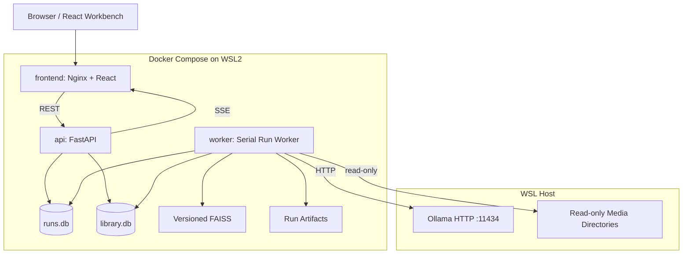
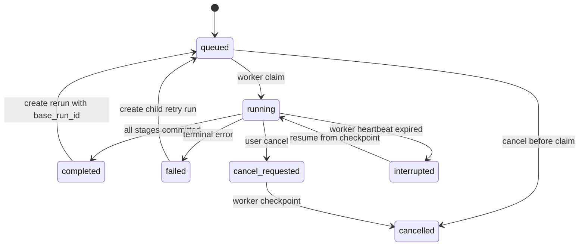
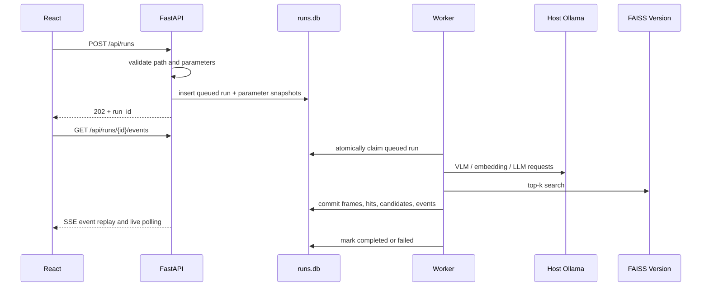

# GifAgent RAG 可视化与测试运行工作台设计

版本：1.0

日期：2026-06-18

状态：已完成交互确认，等待文档审阅

## 1. 背景

GifAgent 已具备以下基础能力：

- 使用 VLM 分析 GIF 或视频帧。
- 使用 LLM 合成媒体级标签和审美描述。
- 使用文本 Embedding 和 FAISS 检索个人收藏中的相似 GIF。
- 对测试视频执行抽帧、检索、RAG 合成和 GIF 导出。
- 使用 SQLite 保存媒体、帧、标注、反馈和向量引用。
- 使用 Gradio 完成基础人工审核。

目前测试视频流程主要由独立脚本执行，结果写入 JSON 和导出目录。系统缺少统一的可观测层，因此难以回答以下问题：

1. 某个视频帧为什么检索到这些收藏 GIF？
2. 哪些检索证据最终影响了候选排名？
3. 调整采样参数、模型、Top-K 或偏好记忆后，结果具体发生了什么变化？
4. 个人收藏在语义空间中形成了哪些情绪、场景和审美聚类？
5. 测试任务运行到哪个阶段，失败原因是什么，能否恢复？

本设计新增一个本地 Web 工作台，把测试运行、检索证据、历史对比和个人偏好地图统一到同一个界面中。

## 2. 已确认决策

以下决策已经由用户确认：

- 工作台采用 React/Vite 独立前端。
- 首要工作区为“测试运行”和“个人偏好地图”。
- 支持已完成结果回放和实时运行进度。
- 支持历史运行和双版本对比。
- Web 可以调整白名单参数并发起测试视频重跑。
- 首版采用单 GPU 任务串行队列。
- 页面采用“双工作区 + 共享媒体检查器”。
- 偏好地图采用 UMAP 二维语义地图，并联动统计分布。
- 后端使用 Docker Compose 部署在 WSL2。
- Ollama 继续运行在 WSL 宿主机，容器通过 HTTP 调用。
- 采用运行中心化架构，不在现有 Gradio 页面上继续堆叠复杂功能。
- 测试运行数据与现有主收藏库分开存储。

## 3. 目标与非目标

### 3.1 目标

1. 解释一次 RAG 测试从视频到候选 GIF 的完整链路。
2. 保存不可变的运行参数、模型、索引和检索证据快照。
3. 支持从 Web 创建、观察、取消、恢复和重跑测试任务。
4. 支持相同视频的逐帧、逐候选和总体指标对比。
5. 将个人收藏以 UMAP 语义地图和统计分布展示。
6. 与长期偏好记忆方案衔接，但不污染历史运行结果。
7. 在约 8,000 个收藏 GIF 的当前规模下保持流畅交互。

### 3.2 非目标

首版不实现：

- 多用户、权限和公网服务。
- 多 GPU 并发调度。
- Kubernetes、Redis、Celery 或 PostgreSQL。
- 替换现有 FAISS 检索实现。
- 在线训练神经网络 reranker。
- 从 Web 删除主收藏库、强制清库或执行任意系统命令。
- 将 Ollama 模型和模型权重迁移进容器。

## 4. 总体架构



### 4.1 服务职责

`frontend`：

- 提供 React 静态资源。
- 反向代理 `/api` 和 SSE 请求。
- 不直接访问数据库、FAISS 或宿主文件系统。

`api`：

- 校验重跑参数和视频路径。
- 创建、查询、取消和比较运行。
- 提供媒体、偏好地图和统计查询。
- 从 `rag_run_events` 重放 SSE 事件。
- 通过明确的反馈服务写入候选反馈，不允许任意 SQL 或文件操作。

`worker`：

- 以事务方式领取一个排队任务。
- 执行抽帧、VLM、Embedding、FAISS 检索、候选合成和导出。
- 将每个阶段的快照写入 `runs.db` 和运行产物目录。
- 响应取消请求并在服务重启后恢复中断任务。

`Ollama`：

- 保持在 WSL 宿主机。
- 沿用现有模型目录、GPU 和显存配置。
- 容器通过 `host.docker.internal:11434` 访问。

## 5. 存储边界

### 5.1 主收藏库

现有 `library.db`、媒体文件和 FAISS 仍是稳定的个人收藏先验。

运行流水线对主库执行只读查询。只有以下明确操作允许写主库：

- 用户提交 like、neutral 或 dislike。
- 用户明确将候选 promote 到主收藏库。
- 管理员显式触发原有入库或索引构建流程。

普通测试运行不能修改主 `media`、`annotations` 或 `vector_refs`。

### 5.2 运行数据库

新增独立 `runs.db`，保存测试任务、阶段、帧、检索证据、候选和实时事件。分库的目的包括：

- 避免高频进度写入与主库长期入库任务争用同一写锁。
- 允许单独备份、清理和迁移测试记录。
- 明确区分稳定收藏事实和可重复执行的实验事实。

### 5.3 运行产物

目录结构：

```text
/app/data/runs/<run_id>/
  run.json
  logs/run.jsonl
  frames/
  candidates/
  exports/
  reports/
```

规则：

- 所有产物先写 `.tmp` 文件，再使用原子重命名发布。
- `run.json` 保存完整参数、模型和索引快照。
- 数据库保存可查询字段，较大的原始响应和二进制文件保存在产物目录。
- 已完成运行的证据文件不可原地覆盖。
- 首版不自动删除运行元数据或产物，也不提供 Web 删除入口；清理只能通过显式 CLI 按 `run_id` 执行，并拒绝清理非终态运行。

## 6. FAISS 索引版本

历史对比要求运行能够准确说明“当时使用了哪个索引”。现有索引文件会原地更新，因此需要增加不可变索引版本目录：

```text
/app/data/faiss/
  current.json
  versions/
    <index_version>/
      media_index.faiss
      id_map.json
      manifest.json
```

`index_version` 使用 manifest 规范化内容和索引文件校验和生成。索引构建完成后：

1. 在临时目录生成 FAISS、ID Map 和 manifest。
2. 完成一致性校验。
3. 原子重命名为不可变版本目录。
4. 原子更新 `current.json` 指针。

运行创建时解析一次 `current.json`，把 `index_version` 固定到 `rag_runs`。Worker 在整个运行期间只打开该版本，不跟随后续索引更新。

现有 `data/faiss/media_index.faiss`、`id_map.json` 和 `manifest.json` 在迁移时导入为首个版本，不删除原文件，确认新路径可用后再停止使用旧路径。

## 7. 运行状态机



约束：

- 同一时刻最多一个任务处于 `running` 或 `cancel_requested`。
- `failed` 和 `completed` 运行不能重新变为 `running`。
- 用户重试或重跑必须创建新 `run_id`。
- 新运行通过 `parent_run_id` 或 `base_run_id` 关联来源。
- Worker 使用 `BEGIN IMMEDIATE` 原子领取任务，不能只依赖进程内锁。
- Worker 每 5 秒更新 heartbeat。
- 超过 30 秒无 heartbeat 的 `running` 任务可标记为 `interrupted`。

## 8. 运行数据模型

### 8.1 `rag_runs`

关键字段：

```text
run_id TEXT PRIMARY KEY
source_video_path TEXT NOT NULL
source_video_sha256 TEXT NOT NULL
status TEXT NOT NULL
progress REAL NOT NULL DEFAULT 0
current_phase TEXT
parameters_json TEXT NOT NULL
model_snapshot_json TEXT NOT NULL
index_version TEXT NOT NULL
base_run_id TEXT
parent_run_id TEXT
error_code TEXT
error_message TEXT
created_at TEXT NOT NULL
started_at TEXT
heartbeat_at TEXT
finished_at TEXT
```

### 8.2 `rag_run_steps`

每个运行包含以下标准阶段：

```text
probe_video
coarse_sampling
vlm_analysis
refine_sampling
embedding
retrieval
candidate_merge
preference_rerank
gif_export
finalize
```

字段包含 `phase`、`status`、`completed_items`、`total_items`、`started_at`、`finished_at`、`error_json` 和 `checkpoint_json`。

### 8.3 `rag_run_frames`

保存：

- `frame_id`、`run_id` 和视频时间戳。
- coarse/refine 采样来源。
- 帧文件相对路径和 SHA256。
- VLM 原始输出、规范化输出和质量状态。
- `gif_worthiness`、情绪和 caption。
- 阶段状态、尝试次数和错误信息。

### 8.4 `rag_retrieval_hits`

每个帧的每个检索命中一行：

```text
run_id
frame_id
rank
media_id
similarity_score
vector_type
query_text
evidence_snapshot_json
index_version
```

`evidence_snapshot_json` 保存当时用于 RAG 的 summary、emotion、tags、film 和文件引用。即使主库标签后来修改，历史运行仍能解释当时的输入。

### 8.5 `rag_run_candidates`

保存：

- 候选开始和结束时间。
- 代表帧。
- 合并原因和参与帧。
- `base_rag_score`。
- `global_preference_score`。
- `scenario_preference_score`。
- `dislike_penalty`。
- `final_score` 和最终排名。
- 导出 GIF 相对路径。
- 可选的长期候选 `candidate_id`。

`rag_run_candidates` 是运行时不可变快照。`version2_新样本处理.md` 中的 `candidate_gifs` 是长期候选实体。用户第一次反馈或 promote 时，系统将运行候选物化为 `candidate_gifs`，然后通过 ID 关联两者。后续反馈不能回写历史运行分数。

`runs.db` 与 `library.db` 之间不建立跨库外键。`media_id` 和 `candidate_id` 是逻辑引用，由 service 层验证并通过幂等键约束写入。

### 8.6 `rag_run_events`

字段：

```text
event_id INTEGER PRIMARY KEY AUTOINCREMENT
run_id TEXT NOT NULL
event_type TEXT NOT NULL
payload_json TEXT NOT NULL
created_at TEXT NOT NULL
```

事件必须在相关业务数据提交后写入同一事务，避免前端收到尚不可查询的状态。

### 8.7 `preference_map_points`

字段：

```text
map_version TEXT NOT NULL
index_version TEXT NOT NULL
media_id TEXT NOT NULL
x REAL NOT NULL
y REAL NOT NULL
cluster_id INTEGER
emotion TEXT
scene_type TEXT
rating TEXT
PRIMARY KEY(map_version, media_id)
```

`map_version` 由索引版本、Embedding 模型、UMAP 参数和聚类参数共同生成。

### 8.8 数据库约束与索引

`runs.db` 启用 `foreign_keys=ON`、WAL、`busy_timeout=5000`。关键约束和索引：

```text
UNIQUE(rag_run_steps.run_id, rag_run_steps.phase)
UNIQUE(rag_retrieval_hits.frame_id, rag_retrieval_hits.rank)
UNIQUE(rag_run_candidates.run_id, rag_run_candidates.rank)
INDEX rag_runs(status, created_at)
INDEX rag_run_frames(run_id, timestamp_ms)
INDEX rag_retrieval_hits(run_id, frame_id)
INDEX rag_run_candidates(run_id, final_score)
INDEX rag_run_events(run_id, event_id)
INDEX preference_map_points(map_version, emotion)
INDEX preference_map_points(map_version, cluster_id)
```

运行进入终态后，帧、检索和候选表只允许补充审计字段，不允许修改原始模型输出、证据快照或评分字段。

## 9. 测试运行数据流



Web 前端不执行 shell 命令。所有重跑都通过类型化请求创建任务，由 Worker 调用内部 Python 服务和 `ffmpeg` 参数数组。

## 10. 流水线重构边界

现有 `scripts/test_video_adaptive.py` 和 `scripts/test_video_rag_v2.py` 包含流程逻辑、配置、打印和文件写入。实施时应提取为可复用服务，而不是让 Worker 通过 shell 调用测试脚本。

建议模块：

```text
app/runs/models.py
app/runs/repository.py
app/runs/parameters.py
app/runs/events.py
app/runs/worker.py
app/runs/pipeline.py
app/runs/comparison.py
app/runs/artifacts.py
app/runs/cancellation.py
app/routers/runs.py
app/routers/preference_map.py
```

`pipeline.py` 只负责编排标准阶段。抽帧、VLM、Embedding、检索和导出继续调用已有 service 层或从测试脚本提取出的单一职责函数。

流水线接口必须显式接收：

- 不可变 `RunParameters`。
- `run_id` 和产物目录。
- 固定 `index_version`。
- 进度回调。
- 取消令牌。

不得读取脚本级全局常量作为运行参数。

## 11. 参数白名单

当前测试脚本的默认参数保持不变。Web 只允许修改以下字段：

| 参数 | 默认值 | 校验范围 |
|---|---:|---:|
| `sample_interval` | 20 秒 | 5-120 秒 |
| `refine_interval` | 10 秒 | 1-30 秒 |
| `refine_radius` | 20 秒 | 0-120 秒 |
| `refine_threshold` | 0.5 | 0.0-1.0 |
| `worthiness_threshold` | 0.4 | 0.0-1.0 |
| `min_duration` | 1.5 秒 | 0.5-10 秒 |
| `max_duration` | 5.0 秒 | 1-20 秒且不小于最小时长 |
| `merge_gap` | 10 秒 | 0-60 秒 |
| `embedding_dedup_threshold` | 0.95 | 0.5-1.0 |
| `top_k` | 5 | 1-20 |
| `output_ratio` | 1.0 | 0.01-1.0 |
| `max_output` | 500 | 1-500 |
| `gif_max_width` | 1920 | 320-1920 |
| `preference_memory_enabled` | false | boolean |

模型名称默认从服务端配置的允许列表选择。客户端不能提交任意 Ollama 模型名称、Prompt、命令行片段或输出目录。

创建运行时将规范化后的参数完整保存到 `parameters_json`。后续修改系统默认值不能改变历史运行。

## 12. API 设计

### 12.1 运行 API

```text
POST /api/runs
GET  /api/runs
GET  /api/runs/{run_id}
POST /api/runs/{run_id}/cancel
POST /api/runs/{run_id}/retry
GET  /api/runs/{run_id}/events
GET  /api/runs/{run_id}/steps
GET  /api/runs/{run_id}/frames
GET  /api/runs/{run_id}/frames/{frame_id}/retrievals
GET  /api/runs/{run_id}/candidates
GET  /api/runs/{run_id}/artifacts/{artifact_path:path}
GET  /api/run-comparisons?left=<id>&right=<id>
```

`POST /api/runs` 成功后返回 HTTP 202 和 `run_id`。

### 12.2 偏好地图 API

```text
GET  /api/preference-map
GET  /api/preference-map/stats
GET  /api/preference-map/{media_id}/neighbors
POST /api/preference-map/rebuild
GET  /api/preference-map/jobs/{job_id}
```

地图响应支持情绪、场景、标签、rating、影片来源和搜索过滤。点数据不包含完整 GIF 二进制，只包含预览 URL 和必要元数据。

### 12.3 反馈衔接

```text
POST /api/run-candidates/{run_candidate_id}/feedback
POST /api/run-candidates/{run_candidate_id}/promote
```

反馈流程：

1. 验证运行候选存在。
2. 如果尚未物化，创建长期 `candidate_gifs` 记录。
3. 写入 `preference_events`。
4. 更新长期候选状态。
5. 保留运行候选的原始评分快照。

## 13. SSE 事件协议

事件类型：

```text
run.queued
run.started
run.heartbeat
step.started
step.progress
frame.completed
retrieval.completed
candidate.created
candidate.reranked
artifact.created
run.cancel_requested
run.cancelled
run.completed
run.failed
run.interrupted
```

SSE 要求：

- `id` 使用 `event_id`。
- 浏览器重连发送 `Last-Event-ID`。
- API 从数据库补发缺失事件后继续轮询。
- 15 秒无业务事件时发送注释 heartbeat，防止代理断开。
- 前端收到事件后只增量更新必要查询，不全页刷新。

## 14. 运行对比

详细对比要求左右运行的 `source_video_sha256` 相同。

对齐规则：

- 首先按标准化视频时间戳对齐。
- 时间差在可配置容差内的帧视为同一位置。
- 仅一侧存在的帧标记为 added 或 removed。
- 检索命中按 `media_id` 对齐。
- 候选按时间区间 IoU 对齐；IoU 不低于 0.5 才视为同一候选。

对比指标：

- 采样帧数量和 VLM 通过率。
- 每帧 Top-K overlap、Jaccard 和排名变化。
- 平均检索相似度。
- 候选新增、删除和保留数量。
- `base_rag_score`、偏好增益、dislike penalty 和最终排名变化。
- 总耗时及各阶段耗时。
- Ollama 请求数、失败数和重试数。

不同源视频只允许比较总体运行指标，不展示逐帧差异。

## 15. 前端信息架构

前端采用 React + TypeScript + Vite。React Router 管理工作区路由，TanStack Query 管理服务端状态，Apache ECharts 使用 Canvas 渲染时间轴、统计图和 UMAP 散点。全局只保存当前选择和筛选条件，不复制后端运行状态。

顶级导航：

```text
Overview
Test Runs
Preference Map
Quality Status
```

首版重点实现 `Test Runs` 和 `Preference Map`。`Overview` 只提供近期运行、队列、索引版本和健康状态摘要；`Quality Status` 复用已有质量统计，不在首版重做完整运维平台。

### 15.1 测试运行工作区

页面布局：

- 左侧：运行历史、状态筛选、基准运行和新建重跑入口。
- 中间：视频预览、处理时间轴、当前帧、Top-K 证据和候选列表。
- 右侧：共享媒体检查器。

核心交互：

- 视频播放位置与帧时间轴双向同步。
- 点击帧显示 VLM 输出、检索 query 和 Top-K 收藏。
- 点击命中 GIF 打开共享检查器。
- 点击候选显示参与帧、分数拆解和导出 GIF。
- 比较模式同时显示左右运行并高亮 added、removed 和 rank changed。
- 实时运行和历史回放使用同一页面组件。

### 15.2 偏好地图工作区

主画布使用 UMAP 二维坐标：

- 默认按 `emotional_core` 着色。
- 可切换场景类型、反馈状态、影片来源或聚类颜色。
- 支持缩放、平移、框选、搜索和多条件过滤。
- 默认只绘制点；hover、选中或高倍率缩放时按需加载缩略图。
- 同屏缩略图设置硬上限，避免一次解码数千个 GIF。

统计侧栏：

- 情绪分布。
- 场景类型分布。
- 标签频率。
- like、neutral、dislike 分布。
- 影片来源分布。

点击统计项过滤地图；框选地图区域反向更新统计。

### 15.3 共享媒体检查器

检查器展示：

- GIF 或帧预览。
- caption、情绪、标签和审美说明。
- 最近邻收藏及相似度。
- 所属 UMAP 聚类和场景画像。
- 历史反馈。
- 出现过的测试运行。
- 当前运行中的 query、Top-K 证据和分数拆解。

检查器提供 like、neutral、dislike。promote 必须使用独立确认动作，不能由 like 自动触发。

## 16. UMAP 与统计计算

地图构建流程：

1. 读取固定 `index_version` 的 FAISS 向量和 ID Map。
2. 使用固定随机种子执行 UMAP。
3. 使用确定性的聚类参数生成 `cluster_id`。
4. 将坐标、版本和筛选字段写入 `preference_map_points`。
5. 预计算常用统计并缓存。

地图在以下条件下失效：

- `index_version` 变化。
- Embedding 模型或维度变化。
- UMAP 或聚类参数变化。

地图重建是独立 CPU 维护任务，不占用 GPU 运行槽，但同一时刻只允许一个地图重建任务。首版允许手动触发，并在检测到新索引版本时显示“地图已过期”。

## 17. 取消、恢复与错误处理

### 17.1 取消

- API 将任务设为 `cancel_requested`。
- Worker 在每个帧、每个模型请求和每个阶段边界检查取消令牌。
- `ffmpeg` 使用独立进程组，取消时先请求正常终止，超时后强制结束该子进程组。
- 已提交的阶段数据保留，临时文件清理。

### 17.2 服务重启恢复

- Worker 启动时扫描 heartbeat 过期的 `running` 任务。
- 状态变为 `interrupted` 并记录事件。
- 只有产物校验和、步骤 checkpoint 和参数快照一致时才从最后完成阶段恢复。
- 无法安全恢复时任务变为 `failed`，用户通过 retry 创建子运行。

### 17.3 错误分类

标准错误码至少包括：

```text
INVALID_PARAMETERS
MEDIA_NOT_FOUND
MEDIA_OUTSIDE_ALLOWED_ROOT
FFPROBE_FAILED
FFMPEG_FAILED
OLLAMA_UNAVAILABLE
MODEL_NOT_AVAILABLE
MODEL_RESPONSE_INVALID
EMBEDDING_FAILED
INDEX_VERSION_MISSING
INDEX_INCONSISTENT
DATABASE_LOCKED
ARTIFACT_WRITE_FAILED
CANCELLED_BY_USER
```

UI 展示可操作错误信息，但完整堆栈只写结构化日志。

## 18. Docker Compose 部署

服务：

```text
frontend
api
worker
```

`api` 和 `worker` 使用同一个 Python 后端镜像，但运行不同入口命令。后端镜像包含 Python 依赖、`ffmpeg` 和 `ffprobe`，不包含 Ollama 模型。

关键挂载：

```text
gifagent_library:/app/data/library
gifagent_runs:/app/data/runs
gifagent_faiss:/app/data/faiss
/mnt/e/...:/media:ro
```

SQLite、FAISS 和运行产物必须位于 WSL ext4 Docker Volume，不放在 `/mnt/c` 或 `/mnt/e` 的 NTFS 目录。原始视频可以从 Windows 目录只读挂载。

关键环境变量：

```text
GIFAGENT_LIBRARY_DB=/app/data/library/library.db
GIFAGENT_RUN_DB=/app/data/runs/runs.db
GIFAGENT_FAISS_ROOT=/app/data/faiss
GIFAGENT_RUN_ROOT=/app/data/runs/artifacts
GIFAGENT_MEDIA_ROOT=/media
OLLAMA_BASE_URL=http://host.docker.internal:11434
```

Compose 需要增加 host gateway 映射。Ollama 必须监听 Docker 网桥可访问的地址，并通过 WSL 防火墙限制访问范围。

前端只绑定 `127.0.0.1`。如果未来允许局域网访问，必须先增加认证、CSRF 防护和更严格的媒体访问控制。

## 19. 健康检查与结构化日志

健康检查：

- API 存活和数据库可读写。
- Worker heartbeat 和当前任务。
- Ollama HTTP 可达、所需模型可用。
- 当前 FAISS 版本存在且 manifest、ID Map、SQL 引用一致。
- 运行产物目录可写。

日志为 JSON Lines，至少包含：

```text
timestamp
level
service
run_id
phase
frame_id
duration_ms
error_code
message
```

不得在日志中保存完整二进制图片、模型权重或任意宿主环境变量。

## 20. 性能策略

- 运行列表、帧和候选均分页查询。
- SSE 事件按 `event_id` 增量读取。
- Top-K 证据只在选中帧时加载。
- GIF 列表使用虚拟滚动和懒加载。
- UMAP 点使用 Canvas/WebGL 渲染，不使用数千个 DOM 节点。
- 同屏动态缩略图数量设置上限。
- 地图点、统计和预览使用 ETag 或版本化缓存。
- 前端切换帧时取消过期请求。

当前规模的验收目标：

- 约 8,000 个地图点首次可交互时间低于 2 秒。
- SSE 业务事件从数据库提交到 UI 展示低于 1 秒。
- 点击帧后 Top-K 证据在本机缓存命中时低于 300 毫秒展示。
- 长列表滚动不一次挂载全部 GIF 元素。

## 21. 测试策略

### 21.1 单元测试

- 参数默认值、范围和交叉字段校验。
- 运行状态机非法转换拒绝。
- SQLite 原子任务领取和单运行约束。
- SSE `Last-Event-ID` 重放。
- 时间戳、检索命中和候选区间对齐。
- 运行候选物化为长期候选时的幂等性。
- 地图版本失效判断。

### 21.2 后端集成测试

- 使用临时 `library.db`、`runs.db` 和 FAISS。
- 使用模拟 Ollama HTTP 响应。
- 使用短合成视频执行完整流水线。
- 验证取消、失败、重启恢复和原子产物发布。
- 验证固定 index version 不受 current 指针变化影响。

### 21.3 API 测试

- 创建、列表、详情、取消、重试和比较。
- 非法路径、越界参数和任意命令注入被拒绝。
- SSE 断线重连不丢事件、不重复应用业务状态。
- 地图过滤、统计和邻居查询一致。

### 21.4 前端测试

使用组件测试和 Playwright 验证：

- 创建重跑表单和参数默认值。
- 实时进度与运行状态更新。
- 视频时间与帧选择同步。
- Top-K 证据和分数拆解。
- 双运行差异展示。
- UMAP 缩放、筛选、框选和统计联动。
- 共享检查器跨页面跳转。
- like、neutral、dislike 和 promote 确认流程。

### 21.5 部署测试

- Docker Compose 一键构建和启动。
- API、Worker 和前端健康检查通过。
- 容器成功访问宿主 Ollama。
- `/media` 不可写。
- WSL ext4 Volume 中的数据库锁和重启持久化正常。

## 22. 兼容性与迁移

1. 不删除现有 API、Gradio 页面或测试脚本。
2. 先提取流水线服务并让原测试脚本调用新服务，避免出现两套行为。
3. 将现有测试 JSON 导入器作为可选工具，用于生成历史 `completed` 运行。
4. 导入记录必须标记 `imported=true`，缺少的阶段证据保持为空，不伪造实时事件。
5. 现有 FAISS 导入首个不可变 index version。
6. 新增功能先使用临时数据库测试，避免在全量 RAG 入库期间迁移正在写入的正式数据库。

## 23. 分阶段实施

### Phase 1：运行数据基础

- `runs.db` schema 和 repository。
- 参数模型和状态机。
- 事件表和 SSE。
- 测试脚本流水线提取。

### Phase 2：Worker 与 Web 重跑

- 单任务 Worker。
- 取消、heartbeat 和恢复。
- 运行 API。
- Docker 后端镜像和宿主 Ollama 连通。

### Phase 3：测试运行前端

- React 框架、运行列表和详情。
- 视频、时间轴、Top-K 和候选检查器。
- 实时进度。

### Phase 4：历史对比

- 固定 FAISS index version。
- 帧、检索和候选对齐。
- 双运行比较 UI。

### Phase 5：个人偏好地图

- UMAP 和聚类任务。
- 地图、统计、筛选和共享检查器。
- 地图版本失效提示。

### Phase 6：偏好记忆衔接

- 运行候选物化。
- like、neutral、dislike。
- 偏好分数拆解。
- promote 确认流程。

每个阶段必须能独立测试和回滚，不允许一次性替换现有完整流水线。

## 24. 验收标准

功能验收：

1. 用户可以在 Web 选择 `/media` 下的视频并创建测试运行。
2. 当前测试参数默认值与 `test_video_adaptive.py` 保持一致。
3. 同一时刻只有一个 GPU 任务运行。
4. 页面可以实时显示阶段、帧进度和错误。
5. 已完成运行可以完整回放每帧 Top-K 证据和候选评分。
6. 重跑不会覆盖原运行，可以选择任意一个历史运行作为 baseline。
7. 相同视频的两个运行可以展示帧、检索和候选排名差异。
8. 偏好地图可以展示全量收藏并按情绪、场景和反馈过滤。
9. 地图和运行页共享媒体检查器并可互相跳转。
10. 反馈会进入长期候选和偏好事件层，但不会修改历史运行分数。
11. Docker Compose 在 WSL2 启动后可访问宿主 Ollama。
12. API 不接受 `/media` 外路径或任意命令参数。

数据验收：

```sql
SELECT status, COUNT(*) FROM rag_runs GROUP BY status;

SELECT COUNT(*)
FROM rag_retrieval_hits h
LEFT JOIN rag_run_frames f ON f.frame_id = h.frame_id
WHERE f.frame_id IS NULL;
-- 必须为 0

SELECT COUNT(*)
FROM rag_run_candidates c
JOIN rag_runs r ON r.run_id = c.run_id
WHERE r.status = 'completed'
  AND (c.final_score IS NULL OR c.rank IS NULL);
-- completed 运行必须为 0

SELECT run_id, COUNT(DISTINCT index_version)
FROM rag_retrieval_hits
GROUP BY run_id
HAVING COUNT(DISTINCT index_version) > 1;
-- 必须为空
```

## 25. 风险与处理

### 25.1 SQLite 锁竞争

风险：实时事件写入频繁，与主库任务争用。

处理：运行数据使用独立 `runs.db`；启用 WAL、busy timeout 和短事务；不在事务中调用 Ollama 或 ffmpeg。

### 25.2 历史结果不可解释

风险：主库标签或 FAISS 更新后，历史证据变化。

处理：固定 `index_version`，并在 retrieval hit 中保存当时使用的文本证据快照。

### 25.3 Web 重跑引入命令执行风险

风险：客户端提交路径、模型名或 shell 参数。

处理：Pydantic 白名单模型、固定媒体根目录、参数数组调用 subprocess、禁止 `shell=True`。

### 25.4 Ollama 不可达

风险：容器无法访问 WSL 宿主机端口。

处理：启动健康检查、host gateway 映射、明确错误码；任务在模型调用前失败，不产生伪造结果。

### 25.5 UMAP 布局漂移

风险：随机性导致同一索引每次布局不同。

处理：固定随机种子，map version 包含完整参数；同一 map version 不重复计算。

### 25.6 偏好反馈污染历史

风险：候选被 like 后反向改变旧运行分数。

处理：运行候选不可变；反馈只写长期候选和偏好事件；新运行才消费新画像。

## 26. 最终结论

本方案将 RAG 可视化定义为一个“运行中心化可观测平台”，而不是静态图表集合。每次测试视频处理都是一个有参数、有版本、有证据、有状态的不可变 Run。测试运行工作区负责解释单次链路和版本差异；个人偏好地图负责解释收藏语义空间；共享媒体检查器把二者连接起来。

主收藏库继续作为稳定审美先验，测试运行数据进入独立 `runs.db`。Web 可以安全发起重跑，但不直接执行脚本或任意命令。后端通过 Docker Compose 运行在 WSL2，Ollama 保留在宿主机，首版使用单 GPU 串行 Worker。这一边界既覆盖当前本地单用户需求，也为后续长期偏好记忆提供稳定接口。
