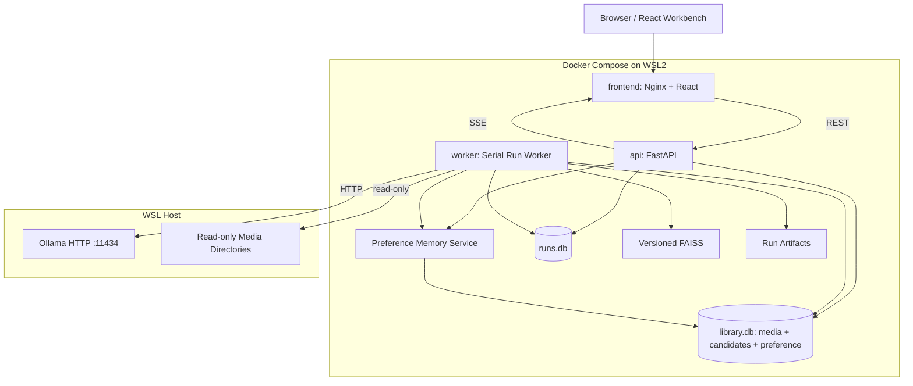
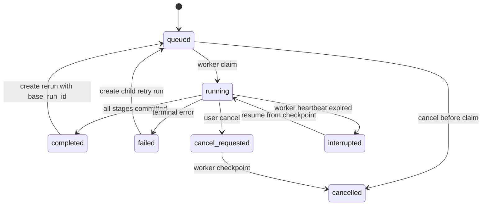
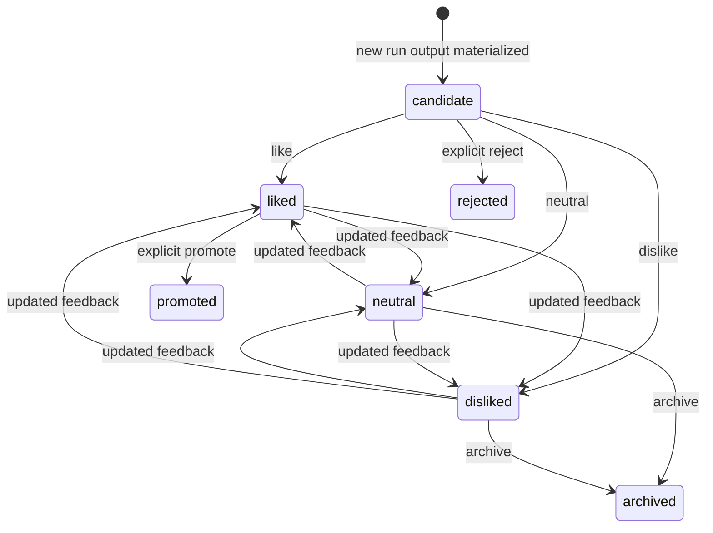
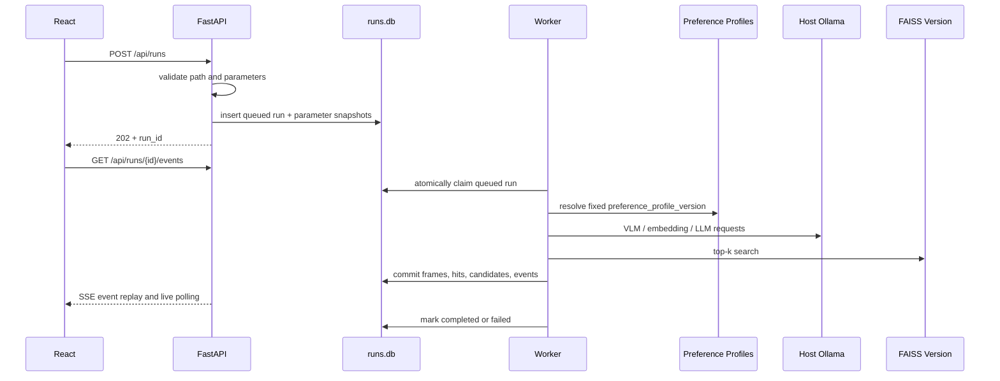

# GifAgent RAG 可视化、测试运行与长期偏好记忆设计

版本：2.0

日期：2026-06-18

状态：已完成方案合并，等待文档审阅

## 1. 背景

GifAgent 已具备以下基础能力：

- 使用 VLM 分析 GIF 或视频帧。
- 使用 LLM 合成媒体级标签和审美描述。
- 使用文本 Embedding 和 FAISS 检索个人收藏中的相似 GIF。
- 对测试视频执行抽帧、检索、RAG 合成和 GIF 导出。
- 使用 SQLite 保存媒体、帧、标注、反馈和向量引用。
- 使用 Gradio 完成基础人工审核。

目前测试视频流程主要由独立脚本执行，结果写入 JSON 和导出目录。系统缺少统一的可观测层和可持续学习的反馈闭环，因此难以回答以下问题：

1. 某个视频帧为什么检索到这些收藏 GIF？
2. 哪些检索证据最终影响了候选排名？
3. 调整采样参数、模型、Top-K 或偏好记忆后，结果具体发生了什么变化？
4. 个人收藏在语义空间中形成了哪些情绪、场景和审美聚类？
5. 测试任务运行到哪个阶段，失败原因是什么，能否恢复？
6. 用户对新候选的 like、neutral 和 dislike 应如何影响下一次推荐？
7. 如何同时保留稳定的主收藏审美，并学习全局与分场景的新偏好？

本设计将此前的 RAG 可视化方案和 `version2_新样本处理.md` 中的 Preference Memory 方案合并为单一规格。系统新增本地 Web 工作台、候选层、偏好事件流和 A+C 长期画像：主收藏库继续提供稳定审美先验，新视频候选的反馈形成全局和分场景记忆，并在后续运行中参与可解释重排。

## 2. 已确认决策

以下决策已经由用户确认：

- 工作台采用 React/Vite 独立前端。
- 首要工作区为“测试运行”和“个人偏好地图”。
- 支持已完成结果回放和实时运行进度。
- 支持历史运行和双版本对比。
- Web 可以调整白名单参数并发起测试视频重跑。
- 首版采用单 GPU 任务串行队列。
- 页面采用“双工作区 + 共享媒体检查器”。
- 偏好地图采用 UMAP 二维语义地图，并联动统计分布。
- 后端使用 Docker Compose 部署在 WSL2。
- Ollama 继续运行在 WSL 宿主机，容器通过 HTTP 调用。
- 采用运行中心化架构，不在现有 Gradio 页面上继续堆叠复杂功能。
- 测试运行数据与现有主收藏库分开存储。
- Preference Memory 采用 A+C：全局偏好画像和分场景偏好画像。
- 新视频 GIF 先进入 `candidate_gifs`，不会自动进入主 `media`。
- like、neutral 和 dislike 追加写入 `preference_events`，画像可从事件流重建。
- Preference Memory 只影响后续候选重排，不改变抽帧、VLM 和 GIF 导出参数。
- 只有用户明确 promote 的候选才写入主 `media` 和主 FAISS。
- 历史运行候选和评分不可被后续反馈覆盖。

## 3. 目标与非目标

### 3.1 目标

1. 解释一次 RAG 测试从视频到候选 GIF 的完整链路。
2. 保存不可变的运行参数、模型、索引和检索证据快照。
3. 支持从 Web 创建、观察、取消、恢复和重跑测试任务。
4. 支持相同视频的逐帧、逐候选和总体指标对比。
5. 将个人收藏以 UMAP 语义地图和统计分布展示。
6. 建立候选、反馈事件、全局画像和分场景画像的长期闭环。
7. 将 Preference Memory 的每个评分分量和使用的画像版本完整可视化。
8. 支持关闭 Preference Memory 得到严格 baseline，并与启用后的运行做 A/B 对比。
9. 保证普通反馈不会污染主收藏库或历史运行结果。
10. 在约 8,000 个收藏 GIF 的当前规模下保持流畅交互。

### 3.2 非目标

首版不实现：

- 多用户、权限和公网服务。
- 多 GPU 并发调度。
- Kubernetes、Redis、Celery 或 PostgreSQL。
- 替换现有 FAISS 检索实现。
- 在线训练神经网络 reranker。
- 自动将所有 liked 候选加入主收藏库。
- 使用单次或极少量反馈生成高权重场景画像。
- 默认启用时间衰减或自动修改历史反馈事件。
- 从 Web 删除主收藏库、强制清库或执行任意系统命令。
- 将 Ollama 模型和模型权重迁移进容器。

## 4. 总体架构



### 4.1 服务职责

`frontend`：

- 提供 React 静态资源。
- 反向代理 `/api` 和 SSE 请求。
- 不直接访问数据库、FAISS 或宿主文件系统。

`api`：

- 校验重跑参数和视频路径。
- 创建、查询、取消和比较运行。
- 提供媒体、偏好地图和统计查询。
- 从 `rag_run_events` 重放 SSE 事件。
- 通过明确的反馈服务写入候选反馈，不允许任意 SQL 或文件操作。

`worker`：

- 以事务方式领取一个排队任务。
- 执行抽帧、VLM、Embedding、FAISS 检索、候选合成和导出。
- 将每个阶段的快照写入 `runs.db` 和运行产物目录。
- 响应取消请求并在服务重启后恢复中断任务。

`Preference Memory Service`：

- 将运行候选幂等物化为长期 `candidate_gifs`。
- 追加记录 like、neutral 和 dislike 事件。
- 从事件水位构建不可变的全局和分场景画像版本。
- 使用固定画像版本计算候选重排分数和可解释分量。
- 执行显式 promote，并在写主库前完成质量和重复检查。

`Ollama`：

- 保持在 WSL 宿主机。
- 沿用现有模型目录、GPU 和显存配置。
- 容器通过 `host.docker.internal:11434` 访问。

## 5. 存储边界

### 5.1 主收藏库

现有 `library.db`、媒体文件和 FAISS 仍是稳定的个人收藏先验。新增候选表和 Preference Memory 表也存放在 `library.db`，但它们属于独立逻辑层，普通候选不会出现在主 `media` 或主 FAISS 中。

运行流水线对主库执行只读查询。只有以下明确操作允许写主库：

- 用户提交 like、neutral 或 dislike。
- 系统重建不可变 Preference Profile 版本。
- 用户明确将候选 promote 到主收藏库。
- 管理员显式触发原有入库或索引构建流程。

普通测试运行不能修改主 `media`、`annotations` 或 `vector_refs`。

逻辑数据层：

```text
stable_library
  media / frames / annotations / vector_refs / main FAISS

candidate_layer
  candidate_gifs / candidate_vectors

preference_memory
  preference_events / preference_profile_builds / preference_profiles

run_observability
  runs.db / run artifacts
```

### 5.2 运行数据库

新增独立 `runs.db`，保存测试任务、阶段、帧、检索证据、候选和实时事件。分库的目的包括：

- 避免高频进度写入与主库长期入库任务争用同一写锁。
- 允许单独备份、清理和迁移测试记录。
- 明确区分稳定收藏事实和可重复执行的实验事实。

### 5.3 运行产物

目录结构：

```text
/app/data/runs/<run_id>/
  run.json
  logs/run.jsonl
  frames/
  candidates/
  exports/
  reports/
```

规则：

- 所有产物先写 `.tmp` 文件，再使用原子重命名发布。
- `run.json` 保存完整参数、模型和索引快照。
- 数据库保存可查询字段，较大的原始响应和二进制文件保存在产物目录。
- 已完成运行的证据文件不可原地覆盖。
- 首版不自动删除运行元数据或产物，也不提供 Web 删除入口；清理只能通过显式 CLI 按 `run_id` 执行，并拒绝清理非终态运行。

## 6. FAISS 索引版本

历史对比要求运行能够准确说明“当时使用了哪个索引”。现有索引文件会原地更新，因此需要增加不可变索引版本目录：

```text
/app/data/faiss/
  current.json
  versions/
    <index_version>/
      media_index.faiss
      id_map.json
      manifest.json
```

`index_version` 使用 manifest 规范化内容和索引文件校验和生成。索引构建完成后：

1. 在临时目录生成 FAISS、ID Map 和 manifest。
2. 完成一致性校验。
3. 原子重命名为不可变版本目录。
4. 原子更新 `current.json` 指针。

运行创建时解析一次 `current.json`，把 `index_version` 固定到 `rag_runs`。Worker 在整个运行期间只打开该版本，不跟随后续索引更新。

现有 `data/faiss/media_index.faiss`、`id_map.json` 和 `manifest.json` 在迁移时导入为首个版本，不删除原文件，确认新路径可用后再停止使用旧路径。

## 7. 运行状态机



约束：

- 同一时刻最多一个任务处于 `running` 或 `cancel_requested`。
- `failed` 和 `completed` 运行不能重新变为 `running`。
- 用户重试或重跑必须创建新 `run_id`。
- 新运行通过 `parent_run_id` 或 `base_run_id` 关联来源。
- Worker 使用 `BEGIN IMMEDIATE` 原子领取任务，不能只依赖进程内锁。
- Worker 每 5 秒更新 heartbeat。
- 超过 30 秒无 heartbeat 的 `running` 任务可标记为 `interrupted`。

## 8. 运行数据模型

### 8.1 `rag_runs`

关键字段：

```text
run_id TEXT PRIMARY KEY
source_video_path TEXT NOT NULL
source_video_sha256 TEXT NOT NULL
status TEXT NOT NULL
progress REAL NOT NULL DEFAULT 0
current_phase TEXT
parameters_json TEXT NOT NULL
model_snapshot_json TEXT NOT NULL
index_version TEXT NOT NULL
preference_memory_enabled INTEGER NOT NULL DEFAULT 0
preference_profile_version TEXT
base_run_id TEXT
parent_run_id TEXT
error_code TEXT
error_message TEXT
created_at TEXT NOT NULL
started_at TEXT
heartbeat_at TEXT
finished_at TEXT
```

### 8.2 `rag_run_steps`

每个运行包含以下标准阶段：

```text
probe_video
coarse_sampling
vlm_analysis
refine_sampling
embedding
retrieval
candidate_merge
preference_rerank
gif_export
finalize
```

字段包含 `phase`、`status`、`completed_items`、`total_items`、`started_at`、`finished_at`、`error_json` 和 `checkpoint_json`。

### 8.3 `rag_run_frames`

保存：

- `frame_id`、`run_id` 和视频时间戳。
- coarse/refine 采样来源。
- 帧文件相对路径和 SHA256。
- VLM 原始输出、规范化输出和质量状态。
- `gif_worthiness`、情绪和 caption。
- 阶段状态、尝试次数和错误信息。

### 8.4 `rag_retrieval_hits`

每个帧的每个检索命中一行：

```text
run_id
frame_id
rank
media_id
similarity_score
vector_type
query_text
evidence_snapshot_json
index_version
```

`evidence_snapshot_json` 保存当时用于 RAG 的 summary、emotion、tags、film 和文件引用。即使主库标签后来修改，历史运行仍能解释当时的输入。

### 8.5 `rag_run_candidates`

保存：

- 候选开始和结束时间。
- 代表帧。
- 合并原因和参与帧。
- `base_rag_score`。
- `global_preference_score`。
- `scenario_preference_score`。
- `dislike_similarity` 和 `dislike_penalty_multiplier`。
- `diversity_bonus`。
- 实际启用的权重和 `preference_profile_version`。
- `final_score` 和最终排名。
- 导出 GIF 相对路径。
- 可选的长期候选 `candidate_id`。

`rag_run_candidates` 是运行时不可变快照，`candidate_gifs` 是长期候选实体。用户第一次反馈或 promote 时，系统将运行候选物化为 `candidate_gifs`，然后通过 ID 关联两者。后续反馈不能回写历史运行分数。

`runs.db` 与 `library.db` 之间不建立跨库外键。`media_id` 和 `candidate_id` 是逻辑引用，由 service 层验证并通过幂等键约束写入。

### 8.6 `rag_run_events`

字段：

```text
event_id INTEGER PRIMARY KEY AUTOINCREMENT
run_id TEXT NOT NULL
event_type TEXT NOT NULL
payload_json TEXT NOT NULL
created_at TEXT NOT NULL
```

事件必须在相关业务数据提交后写入同一事务，避免前端收到尚不可查询的状态。

### 8.7 `preference_map_points`

字段：

```text
map_version TEXT NOT NULL
index_version TEXT NOT NULL
entity_type TEXT NOT NULL
entity_id TEXT NOT NULL
x REAL NOT NULL
y REAL NOT NULL
cluster_id INTEGER
emotion TEXT
scene_type TEXT
rating TEXT
PRIMARY KEY(map_version, entity_type, entity_id)
```

`entity_type` 为 `media` 或 `candidate_gif`。主收藏和长期候选可以分层显示，默认只显示主收藏。`map_version` 由索引版本、候选向量水位、Embedding 模型、UMAP 参数和聚类参数共同生成。

### 8.8 数据库约束与索引

`runs.db` 启用 `foreign_keys=ON`、WAL、`busy_timeout=5000`。关键约束和索引：

```text
UNIQUE(rag_run_steps.run_id, rag_run_steps.phase)
UNIQUE(rag_retrieval_hits.frame_id, rag_retrieval_hits.rank)
UNIQUE(rag_run_candidates.run_id, rag_run_candidates.rank)
INDEX rag_runs(status, created_at)
INDEX rag_run_frames(run_id, timestamp_ms)
INDEX rag_retrieval_hits(run_id, frame_id)
INDEX rag_run_candidates(run_id, final_score)
INDEX rag_run_events(run_id, event_id)
INDEX preference_map_points(map_version, entity_type, emotion)
INDEX preference_map_points(map_version, entity_type, cluster_id)
```

运行进入终态后，帧、检索和候选表只允许补充审计字段，不允许修改原始模型输出、证据快照或评分字段。

## 9. 长期偏好记忆（A+C）

### 9.1 记忆分层

A+C 的含义：

```text
A：稳定个人审美
  主 media + 主 FAISS 形成基础 RAG 先验
  global preference profile 记录跨场景的新反馈修正

C：分场景偏好
  emotion / scene_type / tag profile 记录条件化偏好
```

基础 RAG 始终是主分量。Preference Memory 是反馈驱动的重排层，不改变抽帧、VLM、Embedding、候选合并或 GIF 导出参数。

### 9.2 候选生命周期



状态规则：

- 运行结束不会自动创建主 `media`。
- 用户第一次反馈运行候选时，系统幂等创建 `candidate_gifs`。
- like、neutral 和 dislike 只更新长期候选当前状态并追加事件。
- 反馈不会修改主 FAISS，也不会修改历史 `rag_run_candidates`。
- 只有显式 promote 才能进入主收藏库。

### 9.3 `candidate_gifs`

用途：保存新视频中发现并进入长期审核生命周期的候选 GIF 或片段。

关键字段：

```text
candidate_id TEXT PRIMARY KEY
source_run_id TEXT
source_run_candidate_id TEXT
source_video_id TEXT
source_video_path TEXT NOT NULL
source_video_sha256 TEXT NOT NULL
start REAL NOT NULL
end REAL NOT NULL
duration REAL NOT NULL
representative_frame_path TEXT
exported_gif_path TEXT
export_status TEXT NOT NULL
caption TEXT
summary TEXT
emotional_core TEXT
aesthetic_notes_json TEXT
why_i_like_it TEXT
tags_json TEXT
scene_type TEXT
scenario_keys_json TEXT NOT NULL
base_rag_score_raw REAL
base_rag_score REAL NOT NULL
profile_score REAL
dislike_similarity REAL
dislike_penalty_multiplier REAL
final_score REAL NOT NULL
score_json TEXT NOT NULL
score_profile_version TEXT
status TEXT NOT NULL
promoted_media_id TEXT
model_info_json TEXT
quality_status TEXT NOT NULL
quality_errors_json TEXT
created_at TEXT NOT NULL
updated_at TEXT NOT NULL
```

约束：

```text
UNIQUE(source_run_id, source_run_candidate_id)
CHECK(export_status IN ('not_exported','exported','failed'))
CHECK(status IN ('candidate','liked','disliked','neutral','promoted','rejected','archived'))
INDEX(status, final_score)
INDEX(source_video_sha256)
INDEX(emotional_core)
INDEX(scene_type)
```

`source_run_id` 和 `source_run_candidate_id` 是跨库逻辑引用，不建立 SQLite 外键。重复提交同一运行候选的反馈必须返回同一个 `candidate_id`。

首版不建立 `candidate_review_queue` 表，审核顺序直接通过 `status`、`final_score` 和策略查询生成。只有出现持久化人工分配或多人审核需求时才增加独立队列表。

### 9.4 `candidate_vectors`

第一版将候选文本向量保存在 `library.db`，用于画像和重排，不建立独立候选 FAISS。

```text
vector_id TEXT PRIMARY KEY
candidate_id TEXT NOT NULL
vector_type TEXT NOT NULL
embedding_model TEXT NOT NULL
embedding_dim INTEGER NOT NULL
vector_json TEXT NOT NULL
source_text TEXT NOT NULL
created_at TEXT NOT NULL
FOREIGN KEY(candidate_id) REFERENCES candidate_gifs(candidate_id)
UNIQUE(candidate_id, vector_type, embedding_model)
```

第一版只要求：

```text
vector_type = candidate_text
source_text = summary + emotional_core + why_i_like_it + tags
```

所有向量写入前执行 L2 normalize。Embedding 模型和维度必须与参与重排的 Preference Profile 一致。

### 9.5 `preference_events`

偏好事件是追加写入的事实流，不允许覆盖或物理删除。

```text
event_id TEXT PRIMARY KEY
target_type TEXT NOT NULL
target_id TEXT NOT NULL
rating TEXT NOT NULL
supersedes_event_id TEXT
reason TEXT
corrected_tags_json TEXT
scenario_keys_json TEXT NOT NULL
embedding_model TEXT
embedding_dim INTEGER
target_vector_json TEXT
score_snapshot_json TEXT NOT NULL
model_info_json TEXT
source TEXT NOT NULL
created_at TEXT NOT NULL
```

约束：

```text
CHECK(target_type IN ('media','candidate_gif'))
CHECK(rating IN ('like','dislike','neutral'))
CHECK(source IN ('web_workbench','review_ui','api','import','script'))
INDEX(target_type, target_id, created_at)
INDEX(rating, created_at)
```

事件有效性规则：

- 单用户首版中，同一 `(target_type, target_id)` 最新事件是当前有效反馈。
- 新事件通过 `supersedes_event_id` 指向上一条有效事件。
- Profile rebuild 使用每个目标的最新事件，不把用户修改前后的反馈重复计数。
- 最新事件为 neutral 时，该目标不进入 liked 或 disliked centroid。
- `corrected_tags_json` 影响该事件的 scenario keys，但不覆盖候选原始 VLM 标注。
- `score_snapshot_json` 保存反馈发生时的完整评分解释。
- `target_vector_json` 保存反馈时向量快照，支持历史复盘。

现有 `/api/feedback` 审核主库媒体时，在同一个 `library.db` 事务中同步追加 `target_type='media'` 的 Preference Event。现有 `feedback` 表继续保留，兼容旧 UI。

### 9.6 不可变画像版本

为保证历史运行可解释，Profile rebuild 不直接覆盖唯一一行，而是生成不可变版本。

`preference_profile_builds`：

```text
profile_version TEXT PRIMARY KEY
embedding_model TEXT NOT NULL
embedding_dim INTEGER NOT NULL
source_event_count INTEGER NOT NULL
source_event_max_created_at TEXT
source_event_watermark_json TEXT NOT NULL
config_json TEXT NOT NULL
status TEXT NOT NULL
created_at TEXT NOT NULL
completed_at TEXT
error_json TEXT
CHECK(status IN ('building','completed','failed'))
```

`preference_profiles`：

```text
profile_id TEXT PRIMARY KEY
profile_version TEXT NOT NULL
scope TEXT NOT NULL
scenario_key TEXT NOT NULL
embedding_model TEXT NOT NULL
embedding_dim INTEGER NOT NULL
liked_centroid_json TEXT
disliked_centroid_json TEXT
tag_weights_json TEXT NOT NULL
emotion_weights_json TEXT NOT NULL
scene_type_weights_json TEXT NOT NULL
sample_count_like INTEGER NOT NULL
sample_count_dislike INTEGER NOT NULL
sample_count_neutral INTEGER NOT NULL
confidence REAL NOT NULL
created_at TEXT NOT NULL
FOREIGN KEY(profile_version) REFERENCES preference_profile_builds(profile_version)
UNIQUE(profile_version, scope, scenario_key)
CHECK(scope IN ('global','scenario'))
```

`preference_profile_current` 只保存一个已完成 `profile_version` 指针：

```text
singleton_id INTEGER PRIMARY KEY CHECK(singleton_id = 1)
profile_version TEXT NOT NULL
updated_at TEXT NOT NULL
FOREIGN KEY(profile_version) REFERENCES preference_profile_builds(profile_version)
```

重建完整成功后才能原子切换 current；失败构建不能影响正在使用的画像。

`profile_version` 由 Embedding 模型、维度、规范化构建配置、事件 watermark，以及有效目标的 rating 和向量校验和生成。相同输入必须得到相同版本 ID；已完成版本不可覆盖。

运行创建时：

- `preference_memory_enabled=false` 时，`rag_runs.preference_profile_version=NULL`。
- 启用时解析一次 current，并固定到该运行。
- 运行期间即使 current 更新，也继续使用创建时固定的版本。

### 9.7 场景 key

场景 key 从结构化标注生成：

```text
global
emotion:<emotional_core>
scene_type:<scene_type>
tag:<normalized_tag>
```

生成规则：

1. 永远包含 `global`。
2. 有情绪时加入一个 `emotion:` key。
3. 有场景类型时加入一个 `scene_type:` key。
4. tags 最多取前三个。
5. tag 转小写、空格转下划线，并去除标点和路径符号。
6. 不从文件名、影片名或人物名生成场景 key，避免记住特定样本身份。
7. 相同规则同时用于候选创建、反馈事件和画像查询。

示例：

```json
[
  "global",
  "emotion:intimacy",
  "scene_type:close-up",
  "tag:warm_lighting",
  "tag:soft_focus"
]
```

画像启用门槛：

```text
global/scenario profile 最少有效 like + dislike = 5
liked centroid 最少 like = 3
disliked centroid 最少 dislike = 2
参与重排的 profile confidence >= 0.25
```

不满足门槛的 centroid 视为不存在，不能以零向量参与评分。

### 9.8 画像构建算法

对每个 `global` 或 scenario key：

```text
liked_centroid = normalized weighted mean(latest effective like vectors)
disliked_centroid = normalized weighted mean(latest effective dislike vectors)
```

第一版关闭时间衰减，每个有效目标权重相同。保留配置：

```text
time_decay_enabled = false
half_life_days = 180
```

标签、情绪和场景权重：

```text
raw_weight = (likes - 1.5 * dislikes) / max(likes + dislikes, 1)
weight = clamp(raw_weight, -1, 1)
```

Profile confidence：

```text
effective_count = like_count + dislike_count
confidence = min(1.0, effective_count / 20)
```

neutral 不参与 centroid 和 confidence；它表示“当前不用于学习”，同时保留审计历史。

Embedding 兼容规则：

- 一个 Profile build 只能使用同一模型和维度的事件向量。
- 模型变化后必须生成新的 Profile version。
- 缺少当前模型向量的目标先重新计算向量；无法重算的事件从本次构建排除并计入报告。
- 不能把不同模型的向量填充、截断或直接平均。

### 9.9 重排算法

候选的可解释分量：

```text
base_rag_similarity
global_like_similarity
scenario_like_similarity
dislike_similarity
diversity_bonus
```

所有 cosine similarity 在评分前裁剪到 `[0, 1]`。默认权重：

```text
base_rag_similarity      0.45
global_like_similarity   0.20
scenario_like_similarity 0.15
dislike_avoidance        0.15
diversity_bonus          0.05
```

定义：

- `base_rag_similarity`：候选与主收藏库 Top-K 的配置化加权相似度。
- `global_like_similarity`：候选与 global liked centroid 的 cosine similarity。
- `scenario_like_similarity`：匹配场景画像的 `similarity * confidence` 加权平均。
- `dislike_similarity`：global 和有效场景 disliked centroid 相似度的最大值。
- `dislike_avoidance = 1 - dislike_similarity`。
- `diversity_bonus`：候选集合去同质化奖励；首版未实现时该分量标记为 unavailable。

可用分量归一化公式：

```text
active_components = 只包含实际存在且达到启用门槛的分量

raw_score =
  sum(component_value * configured_weight for active_components)
  / sum(configured_weight for active_components)
```

`base_rag_similarity` 永远可用。缺少的画像和未实现的 diversity 不以 0 参与分母。因此：

```text
Preference Memory 关闭 -> final_score = base_rag_similarity
没有有效 Profile      -> final_score = base_rag_similarity
```

`profile_score` 只汇总实际可用的 global like、scenario like 和 dislike avoidance 分量；没有任何可用记忆分量时为 `NULL`。`raw_score` 是 base 与可用记忆分量归一化后的组合分数。

dislike 主动惩罚：

```text
if dislike_similarity >= 0.85:
    penalty_multiplier = 0.4
elif dislike_similarity >= 0.75:
    penalty_multiplier = 0.7
else:
    penalty_multiplier = 1.0

final_score = clamp(raw_score * penalty_multiplier, 0, 1)
```

没有有效 disliked centroid 时，`dislike_similarity` 为 unavailable，`penalty_multiplier=1.0`。

`score_json` 必须保存：

- 原始和归一化 base RAG 分数。
- 每个分量、配置权重、是否 active 和缺失原因。
- 命中的 global/scenario profile ID、confidence 和相似度。
- `profile_version`。
- penalty 阈值、乘数、raw score 和 final score。

### 9.10 Rebuild 策略

反馈写入和画像构建解耦：

```text
feedback -> append event -> update candidate current status
rebuild  -> read event watermark -> build immutable profiles -> validate -> switch current
```

构建开始时记录 `(created_at, event_id)` watermark。构建期间新到达的事件不进入本版本，等待下一次 rebuild；同一目标在 watermark 前的最新事件才是本版本有效反馈。

支持：

- 手动 API 或 CLI 重建。
- 累计 10 条新的有效事件后自动重建。

首版默认自动重建关闭，完成离线 A/B 验证后再开启。Rebuild 只使用已保存向量，不在运行中临时调用 VLM；如果需要补 Embedding，先创建独立预计算任务。

### 9.11 显式晋升

promote 前置条件：

```text
confirm = true
quality_status = passed
export_status = exported
exported_gif_path 存在且位于允许目录
未发现近重复
```

重复检查顺序：

1. SHA256 完全重复。
2. pHash 距离不大于配置阈值。
3. Embedding similarity 大于 0.97。

晋升动作：

1. 写入主 `media`、`frames` 和 `annotations`。
2. 计算主媒体 embedding。
3. 构建新的不可变 FAISS index version，并原子切换 current。
4. 写入 `vector_refs`。
5. 将候选设为 `promoted` 并记录 `promoted_media_id`。

任一步骤失败都不能让半完成媒体进入当前主索引。重复 promote 同一候选必须幂等返回已有 `promoted_media_id`。

### 9.12 配置

```yaml
preference_memory:
  enabled: false
  auto_rebuild_enabled: false
  auto_rebuild_every_events: 10
  min_total_samples: 5
  min_like_samples: 3
  min_dislike_samples: 2
  min_profile_confidence: 0.25
  dislike_hard_penalty_threshold: 0.85
  dislike_soft_penalty_threshold: 0.75
  time_decay_enabled: false
  half_life_days: 180
  weights:
    base_rag_similarity: 0.45
    global_like_similarity: 0.20
    scenario_like_similarity: 0.15
    dislike_avoidance: 0.15
    diversity_bonus: 0.05
```

系统升级后默认仍关闭 Preference Memory，确保现有测试参数和排序不变。用户可以按运行启用，并通过 baseline 对比验证后再修改默认开关。

## 10. 测试运行数据流



Web 前端不执行 shell 命令。所有重跑都通过类型化请求创建任务，由 Worker 调用内部 Python 服务和 `ffmpeg` 参数数组。

## 11. 流水线重构边界

现有 `scripts/test_video_adaptive.py` 和 `scripts/test_video_rag_v2.py` 包含流程逻辑、配置、打印和文件写入。实施时应提取为可复用服务，而不是让 Worker 通过 shell 调用测试脚本。

建议模块：

```text
app/runs/models.py
app/runs/repository.py
app/runs/parameters.py
app/runs/events.py
app/runs/worker.py
app/runs/pipeline.py
app/runs/comparison.py
app/runs/artifacts.py
app/runs/cancellation.py
app/services/scenario.py
app/services/candidates.py
app/services/preference_memory.py
app/services/reranker.py
app/services/promotion.py
app/routers/runs.py
app/routers/preference_map.py
app/routers/candidates.py
app/routers/preference.py
```

`pipeline.py` 只负责编排标准阶段。抽帧、VLM、Embedding、检索和导出继续调用已有 service 层或从测试脚本提取出的单一职责函数。

流水线接口必须显式接收：

- 不可变 `RunParameters`。
- `run_id` 和产物目录。
- 固定 `index_version`。
- 固定 `preference_profile_version`；关闭 Preference Memory 时为 `None`。
- 进度回调。
- 取消令牌。

不得读取脚本级全局常量作为运行参数。

## 12. 参数白名单

当前测试脚本的默认参数保持不变。Web 只允许修改以下字段：

| 参数 | 默认值 | 校验范围 |
|---|---:|---:|
| `sample_interval` | 20 秒 | 5-120 秒 |
| `refine_interval` | 10 秒 | 1-30 秒 |
| `refine_radius` | 20 秒 | 0-120 秒 |
| `refine_threshold` | 0.5 | 0.0-1.0 |
| `worthiness_threshold` | 0.4 | 0.0-1.0 |
| `min_duration` | 1.5 秒 | 0.5-10 秒 |
| `max_duration` | 5.0 秒 | 1-20 秒且不小于最小时长 |
| `merge_gap` | 10 秒 | 0-60 秒 |
| `embedding_dedup_threshold` | 0.95 | 0.5-1.0 |
| `top_k` | 5 | 1-20 |
| `output_ratio` | 1.0 | 0.01-1.0 |
| `max_output` | 500 | 1-500 |
| `gif_max_width` | 1920 | 320-1920 |
| `preference_memory_enabled` | false | boolean |
| `preference_profile_version` | current | 已完成且 Embedding 兼容的版本，关闭记忆时忽略 |

模型名称默认从服务端配置的允许列表选择。客户端不能提交任意 Ollama 模型名称、Prompt、命令行片段或输出目录。

创建运行时将规范化后的参数完整保存到 `parameters_json`。后续修改系统默认值不能改变历史运行。

## 13. API 设计

### 13.1 运行 API

```text
POST /api/runs
GET  /api/runs
GET  /api/runs/{run_id}
POST /api/runs/{run_id}/cancel
POST /api/runs/{run_id}/retry
GET  /api/runs/{run_id}/events
GET  /api/runs/{run_id}/steps
GET  /api/runs/{run_id}/frames
GET  /api/runs/{run_id}/frames/{frame_id}/retrievals
GET  /api/runs/{run_id}/candidates
GET  /api/runs/{run_id}/artifacts/{artifact_path:path}
GET  /api/run-comparisons?left=<id>&right=<id>
```

`POST /api/runs` 成功后返回 HTTP 202 和 `run_id`。

### 13.2 偏好地图 API

```text
GET  /api/preference-map
GET  /api/preference-map/stats
GET  /api/preference-map/{media_id}/neighbors
POST /api/preference-map/rebuild
GET  /api/preference-map/jobs/{job_id}
```

地图响应支持情绪、场景、标签、rating、影片来源和搜索过滤。点数据不包含完整 GIF 二进制，只包含预览 URL 和必要元数据。

地图查询增加 `entity_type=media|candidate_gif|all`，默认 `media`。

### 13.3 候选与 Preference Memory API

```text
GET  /api/candidates
GET  /api/candidates/next
GET  /api/candidates/{candidate_id}
POST /api/candidates/{candidate_id}/feedback
POST /api/candidates/{candidate_id}/promote
POST /api/candidates/rerank

POST /api/run-candidates/{run_candidate_id}/feedback
POST /api/run-candidates/{run_candidate_id}/promote

POST /api/preference/rebuild
GET  /api/preference/builds
GET  /api/preference/profiles
GET  /api/preference/profiles/{profile_id}
```

`GET /api/candidates/next` 支持：

```text
status=candidate
strategy=highest_score | random | uncertain
scenario_key=<optional>
```

反馈请求：

```json
{
  "rating": "like",
  "reason": "喜欢这个近景情绪和暖色光线",
  "corrected_tags": ["close-up", "warm_lighting"]
}
```

运行候选反馈流程：

1. 验证运行候选存在。
2. 如果尚未物化，创建长期 `candidate_gifs` 记录。
3. 在同一事务中追加 `preference_events` 并更新长期候选当前状态。
4. 返回 `candidate_id`、`event_id` 和当前 Profile 水位状态。
5. 保留运行候选的原始评分快照。

`POST /api/preference/rebuild` 创建不可变 Profile build。构建只读取创建任务时固定 watermark 以内的事件。`POST /api/candidates/rerank` 只更新长期候选的当前分数，不修改任何历史运行候选。promote 请求必须包含 `confirm=true`。

### 13.4 CLI

```text
uv run python scripts/preference_memory.py status
uv run python scripts/preference_memory.py rebuild --apply
uv run python scripts/pipeline.py candidates rerank --limit 100 --apply
uv run python scripts/pipeline.py candidates promote <candidate_id> --confirm
```

所有写操作必须显式使用 `--apply` 或 `--confirm`。批量 rerank 必须提供 `--limit` 或源视频范围，禁止默认重排全库。

## 14. SSE 事件协议

事件类型：

```text
run.queued
run.started
run.heartbeat
step.started
step.progress
frame.completed
retrieval.completed
candidate.created
candidate.reranked
artifact.created
run.cancel_requested
run.cancelled
run.completed
run.failed
run.interrupted
```

SSE 要求：

- `id` 使用 `event_id`。
- 浏览器重连发送 `Last-Event-ID`。
- API 从数据库补发缺失事件后继续轮询。
- 15 秒无业务事件时发送注释 heartbeat，防止代理断开。
- 前端收到事件后只增量更新必要查询，不全页刷新。

## 15. 运行对比

详细对比要求左右运行的 `source_video_sha256` 相同。

对齐规则：

- 首先按标准化视频时间戳对齐。
- 时间差在可配置容差内的帧视为同一位置。
- 仅一侧存在的帧标记为 added 或 removed。
- 检索命中按 `media_id` 对齐。
- 候选按时间区间 IoU 对齐；IoU 不低于 0.5 才视为同一候选。

对比指标：

- 采样帧数量和 VLM 通过率。
- 每帧 Top-K overlap、Jaccard 和排名变化。
- 平均检索相似度。
- 候选新增、删除和保留数量。
- `base_rag_score`、偏好增益、dislike penalty 和最终排名变化。
- Profile version、命中场景画像和 active 分量变化。
- 总耗时及各阶段耗时。
- Ollama 请求数、失败数和重试数。

不同源视频只允许比较总体运行指标，不展示逐帧差异。

## 16. 前端信息架构

前端采用 React + TypeScript + Vite。React Router 管理工作区路由，TanStack Query 管理服务端状态，Apache ECharts 使用 Canvas 渲染时间轴、统计图和 UMAP 散点。全局只保存当前选择和筛选条件，不复制后端运行状态。

顶级导航：

```text
Overview
Test Runs
Preference Map
Quality Status
```

首版重点实现 `Test Runs` 和 `Preference Map`。`Overview` 只提供近期运行、队列、索引版本和健康状态摘要；`Quality Status` 复用已有质量统计，不在首版重做完整运维平台。

### 16.1 测试运行工作区

页面布局：

- 左侧：运行历史、状态筛选、基准运行和新建重跑入口。
- 中间：视频预览、处理时间轴、当前帧、Top-K 证据和候选列表。
- 右侧：共享媒体检查器。

核心交互：

- 视频播放位置与帧时间轴双向同步。
- 点击帧显示 VLM 输出、检索 query 和 Top-K 收藏。
- 点击命中 GIF 打开共享检查器。
- 点击候选显示参与帧、分数拆解和导出 GIF。
- 新建重跑表单提供 Preference Memory 开关；启用后展示将要固定的 current Profile version。
- 比较模式同时显示左右运行并高亮 added、removed 和 rank changed。
- 实时运行和历史回放使用同一页面组件。

### 16.2 偏好地图工作区

主画布使用 UMAP 二维坐标：

- 默认按 `emotional_core` 着色。
- 提供“主收藏 / 长期候选 / 全部”分层切换。
- 可切换场景类型、反馈状态、影片来源或聚类颜色。
- 支持缩放、平移、框选、搜索和多条件过滤。
- 默认只绘制点；hover、选中或高倍率缩放时按需加载缩略图。
- 同屏缩略图设置硬上限，避免一次解码数千个 GIF。

统计侧栏：

- 情绪分布。
- 场景类型分布。
- 标签频率。
- like、neutral、dislike 分布。
- 影片来源分布。

点击统计项过滤地图；框选地图区域反向更新统计。

Preference Map 工作区内部提供 `Map` 和 `Review Queue` 两个标签。Review Queue 使用 `highest_score`、`uncertain` 或 `random` 策略加载长期候选，不新增第三个顶级工作区。

### 16.3 共享媒体检查器

检查器展示：

- GIF 或帧预览。
- caption、情绪、标签和审美说明。
- 最近邻收藏及相似度。
- 所属 UMAP 聚类和场景画像。
- 历史反馈。
- 出现过的测试运行。
- 当前运行中的 query、Top-K 证据和分数拆解。
- 当前 Profile version、global profile 和命中的 scenario profiles。
- 每个 Profile 的样本数、confidence、相似度和最终贡献。

检查器提供 like、neutral、dislike。promote 必须使用独立确认动作，不能由 like 自动触发。

## 17. UMAP 与统计计算

地图构建流程：

1. 读取固定 `index_version` 的 FAISS 向量和 ID Map。
2. 读取相同 Embedding 模型和维度的 `candidate_vectors`。
3. 使用固定随机种子对主收藏和候选联合执行 UMAP。
4. 使用确定性的聚类参数生成 `cluster_id`。
5. 将坐标、实体类型、版本和筛选字段写入 `preference_map_points`。
6. 预计算常用统计并缓存。

地图在以下条件下失效：

- `index_version` 变化。
- 候选向量水位变化。
- Embedding 模型或维度变化。
- UMAP 或聚类参数变化。

地图重建是独立 CPU 维护任务，不占用 GPU 运行槽，但同一时刻只允许一个地图重建任务。首版允许手动触发，并在检测到新索引版本时显示“地图已过期”。

## 18. 取消、恢复与错误处理

### 18.1 取消

- API 将任务设为 `cancel_requested`。
- Worker 在每个帧、每个模型请求和每个阶段边界检查取消令牌。
- `ffmpeg` 使用独立进程组，取消时先请求正常终止，超时后强制结束该子进程组。
- 已提交的阶段数据保留，临时文件清理。

### 18.2 服务重启恢复

- Worker 启动时扫描 heartbeat 过期的 `running` 任务。
- 状态变为 `interrupted` 并记录事件。
- 只有产物校验和、步骤 checkpoint 和参数快照一致时才从最后完成阶段恢复。
- 无法安全恢复时任务变为 `failed`，用户通过 retry 创建子运行。

### 18.3 错误分类

标准错误码至少包括：

```text
INVALID_PARAMETERS
MEDIA_NOT_FOUND
MEDIA_OUTSIDE_ALLOWED_ROOT
FFPROBE_FAILED
FFMPEG_FAILED
OLLAMA_UNAVAILABLE
MODEL_NOT_AVAILABLE
MODEL_RESPONSE_INVALID
EMBEDDING_FAILED
INDEX_VERSION_MISSING
INDEX_INCONSISTENT
PROFILE_VERSION_MISSING
PROFILE_EMBEDDING_MISMATCH
PROFILE_BUILD_FAILED
CANDIDATE_NOT_EXPORTABLE
CANDIDATE_DUPLICATE
PROMOTION_FAILED
DATABASE_LOCKED
ARTIFACT_WRITE_FAILED
CANCELLED_BY_USER
```

UI 展示可操作错误信息，但完整堆栈只写结构化日志。

## 19. Docker Compose 部署

服务：

```text
frontend
api
worker
```

`api` 和 `worker` 使用同一个 Python 后端镜像，但运行不同入口命令。后端镜像包含 Python 依赖、`ffmpeg` 和 `ffprobe`，不包含 Ollama 模型。

关键挂载：

```text
gifagent_library:/app/data/library
gifagent_runs:/app/data/runs
gifagent_faiss:/app/data/faiss
/mnt/e/...:/media:ro
```

SQLite、FAISS 和运行产物必须位于 WSL ext4 Docker Volume，不放在 `/mnt/c` 或 `/mnt/e` 的 NTFS 目录。原始视频可以从 Windows 目录只读挂载。

关键环境变量：

```text
GIFAGENT_LIBRARY_DB=/app/data/library/library.db
GIFAGENT_RUN_DB=/app/data/runs/runs.db
GIFAGENT_FAISS_ROOT=/app/data/faiss
GIFAGENT_RUN_ROOT=/app/data/runs/artifacts
GIFAGENT_MEDIA_ROOT=/media
OLLAMA_BASE_URL=http://host.docker.internal:11434
PREFERENCE_MEMORY_ENABLED=false
```

Compose 需要增加 host gateway 映射。Ollama 必须监听 Docker 网桥可访问的地址，并通过 WSL 防火墙限制访问范围。

前端只绑定 `127.0.0.1`。如果未来允许局域网访问，必须先增加认证、CSRF 防护和更严格的媒体访问控制。

## 20. 健康检查与结构化日志

健康检查：

- API 存活和数据库可读写。
- Worker heartbeat 和当前任务。
- Ollama HTTP 可达、所需模型可用。
- 当前 FAISS 版本存在且 manifest、ID Map、SQL 引用一致。
- current Preference Profile 指向 completed build，模型和维度兼容。
- 未构建事件数量和最近一次 Profile build 状态。
- 运行产物目录可写。

日志为 JSON Lines，至少包含：

```text
timestamp
level
service
run_id
phase
frame_id
duration_ms
error_code
message
```

不得在日志中保存完整二进制图片、模型权重或任意宿主环境变量。

## 21. 性能策略

- 运行列表、帧和候选均分页查询。
- SSE 事件按 `event_id` 增量读取。
- Top-K 证据只在选中帧时加载。
- GIF 列表使用虚拟滚动和懒加载。
- UMAP 点使用 Canvas/WebGL 渲染，不使用数千个 DOM 节点。
- 同屏动态缩略图数量设置上限。
- 地图点、统计和预览使用 ETag 或版本化缓存。
- 前端切换帧时取消过期请求。

当前规模的验收目标：

- 约 8,000 个地图点首次可交互时间低于 2 秒。
- SSE 业务事件从数据库提交到 UI 展示低于 1 秒。
- 点击帧后 Top-K 证据在本机缓存命中时低于 300 毫秒展示。
- 长列表滚动不一次挂载全部 GIF 元素。

## 22. 测试策略

### 22.1 单元测试

- 参数默认值、范围和交叉字段校验。
- 运行状态机非法转换拒绝。
- SQLite 原子任务领取和单运行约束。
- SSE `Last-Event-ID` 重放。
- 时间戳、检索命中和候选区间对齐。
- 运行候选物化为长期候选时的幂等性。
- 地图版本失效判断。
- scenario key 永远包含 global，tag 归一化且最多三个。
- 同一目标多次反馈只使用最新事件构建画像。
- neutral 不进入 liked 或 disliked centroid。
- 样本不足时 scenario profile 不参与评分。
- Profile build 只接受相同 Embedding 模型和维度的向量。
- Preference Memory 关闭或无有效 Profile 时 `final_score == base_rag_similarity`。
- global、scenario 和 dislike 分量按可用权重归一化。
- dislike 达到软硬阈值时应用正确乘数。
- promote 的确认、质量、导出文件和重复检查。

### 22.2 后端集成测试

- 使用临时 `library.db`、`runs.db` 和 FAISS。
- 使用模拟 Ollama HTTP 响应。
- 使用短合成视频执行完整流水线。
- 验证取消、失败、重启恢复和原子产物发布。
- 验证固定 index version 不受 current 指针变化影响。
- 验证运行固定 Profile version，不受 current Profile 切换影响。
- 验证 Profile build 失败不会切换 current。
- 验证反馈不会写入主 `media` 或主 FAISS。
- 验证 promote 成功后创建新 FAISS index version。

### 22.3 API 测试

- 创建、列表、详情、取消、重试和比较。
- 非法路径、越界参数和任意命令注入被拒绝。
- SSE 断线重连不丢事件、不重复应用业务状态。
- 地图过滤、统计和邻居查询一致。
- 候选反馈追加事件、更新状态并保持运行快照不变。
- Profile rebuild、查询、rerank 和 promote API 的幂等性。

### 22.4 前端测试

使用组件测试和 Playwright 验证：

- 创建重跑表单和参数默认值。
- 实时进度与运行状态更新。
- 视频时间与帧选择同步。
- Top-K 证据和分数拆解。
- 双运行差异展示。
- UMAP 缩放、筛选、框选和统计联动。
- 共享检查器跨页面跳转。
- like、neutral、dislike 和 promote 确认流程。
- Profile 命中原因、confidence、分量权重和 penalty 展示。
- baseline 与 Preference Memory 运行的排名差异展示。

### 22.5 部署测试

- Docker Compose 一键构建和启动。
- API、Worker 和前端健康检查通过。
- 容器成功访问宿主 Ollama。
- `/media` 不可写。
- WSL ext4 Volume 中的数据库锁和重启持久化正常。
- API 和 Worker 对同一 current Profile version 的解析一致。

## 23. 兼容性与迁移

1. 不删除现有 API、Gradio 页面或测试脚本。
2. 先提取流水线服务并让原测试脚本调用新服务，避免出现两套行为。
3. 将现有测试 JSON 导入器作为可选工具，用于生成历史 `completed` 运行。
4. 导入记录必须标记 `imported=true`，缺少的阶段证据保持为空，不伪造实时事件。
5. 现有 FAISS 导入首个不可变 index version。
6. 新增功能先使用临时数据库测试，避免在全量 RAG 入库期间迁移正在写入的正式数据库。
7. 现有 `feedback` 表继续保留；新反馈在同一事务中双写 `preference_events`。
8. 现有 `video_clips` 保留不动，不承担长期候选状态；新流程使用 `candidate_gifs`。
9. 本文档是 RAG 可视化与 Preference Memory 的统一权威规格，`version2_新样本处理.md` 仅保留为历史来源，不作为独立实施依据。

## 24. 统一实施顺序

执行原则：

```text
观测底座 -> Preference Memory 核心 -> A/B 验证 -> 完整 Web -> 反馈闭环
```

不能先完成全部 React 页面再补 Preference Memory，否则候选生命周期、评分字段和 API 会发生结构性返工。也不能在没有 baseline 快照时直接把 reranker 接进现有脚本，否则无法判断精度变化来源。

### Phase 0：冻结基线与运行环境

- 等待当前全量入库任务结束，或在明确 checkpoint 后暂停。
- 备份 `library.db`、主 FAISS manifest 和配置。
- 执行主库与索引一致性检查。
- 保存至少一个当前测试视频 baseline 结果。
- 禁止在正式数据库仍有长任务写入时执行 schema 迁移。

验收门：主库和 FAISS 校验通过，baseline 参数和结果可追踪。

### Phase 1：统一契约与 Schema

- 定义 `ScoreBreakdown`、scenario key、`candidate_id` 和跨库逻辑引用。
- 建立 `runs.db` schema、状态机和 repository。
- 在临时 `library.db` 建立 candidate、event 和 immutable profile schema。
- 实现配置默认值和幂等 migration。
- 建立不可变 FAISS index version。

验收门：所有 schema、约束、迁移和纯函数测试通过，不接入正式运行。

### Phase 2：最小观测底座

- 将测试脚本逻辑提取为可调用 Pipeline。
- 实现运行参数快照、帧、Top-K、候选和事件记录。
- 实现单任务 Worker、取消、heartbeat 和恢复。
- 实现运行 API、SSE 和 CLI。
- 建立 Docker 后端骨架并连通宿主 Ollama。
- 强制 `preference_memory_enabled=false`。

验收门：同一 baseline 能通过新 Pipeline 完成，历史证据可回放；关闭 Preference Memory 时排序逻辑不变。

### Phase 3：Preference Memory 核心

- 实现 `scenario.py`、`candidates.py` 和运行候选幂等物化。
- 实现 append-only Preference Event 和 latest-effective 语义。
- 实现 immutable Profile build、current 指针和查询 API。
- 实现 global 与 scenario centroid、标签权重和 confidence。
- 继续保持默认关闭，不接管生产排序。

验收门：事件可完整重建同一 Profile version，失败构建不切换 current。

### Phase 4：Reranker 与离线 A/B

- 实现 availability-aware 权重归一化和 dislike penalty。
- 将固定 Profile version 接入运行 Pipeline。
- 对相同视频、参数、模型和 index version 运行 baseline 与 memory 两组。
- 使用留出反馈计算 Like@K、Dislike@K、NDCG 和排名变化。
- 生成机器可读和可视化对比报告。

验收门：无 Profile 时严格等于 baseline；有 Profile 时每个排名变化都有分数解释。

### Phase 5：React 测试运行工作区

- 完成运行历史、实时进度、视频时间轴、Top-K 和候选检查器。
- 完成 baseline 与 Preference Memory 双运行对比。
- 展示 Profile version、命中场景、confidence、分量和 penalty。

验收门：用户能在 Web 发起关闭/启用记忆的两次运行并完成对比。

### Phase 6：偏好地图与反馈闭环

- 完成主收藏和候选分层 UMAP。
- 完成情绪、场景、标签和 rating 联动统计。
- 接通 like、neutral、dislike 和 Profile rebuild。
- 新 Profile 只影响后续运行。

验收门：反馈事件增加、画像版本更新、新运行消费新版本，旧运行保持不变。

### Phase 7：显式晋升与部署加固

- 实现 promote 质量门、重复检测和幂等性。
- promote 后创建新主媒体和新 FAISS index version。
- 完成 Docker Compose、健康检查、恢复、性能和 Playwright 测试。
- 完成正式数据迁移和回滚演练。

验收门：Docker 环境完成端到端闭环，主库没有由普通 like 自动新增的媒体。

允许并行的工作：Phase 2 API 契约固定后可并行搭建 React 外壳和 Docker 镜像。禁止并行修改的边界：候选 schema、ScoreBreakdown、Profile version 和 promote 事务必须由同一实施计划统一管理。

每个阶段必须能独立测试和回滚，不允许一次性替换现有完整流水线。

## 25. 验收标准

功能验收：

1. 用户可以在 Web 选择 `/media` 下的视频并创建测试运行。
2. 当前测试参数默认值与 `test_video_adaptive.py` 保持一致。
3. 同一时刻只有一个 GPU 任务运行。
4. 页面可以实时显示阶段、帧进度和错误。
5. 已完成运行可以完整回放每帧 Top-K 证据和候选评分。
6. 重跑不会覆盖原运行，可以选择任意一个历史运行作为 baseline。
7. 相同视频的两个运行可以展示帧、检索和候选排名差异。
8. 偏好地图可以展示全量收藏并按情绪、场景和反馈过滤。
9. 地图和运行页共享媒体检查器并可互相跳转。
10. 反馈会进入长期候选和偏好事件层，但不会修改历史运行分数。
11. Docker Compose 在 WSL2 启动后可访问宿主 Ollama。
12. API 不接受 `/media` 外路径或任意命令参数。
13. 同一运行候选被重复反馈只物化一个 `candidate_gifs`。
14. like、neutral 和 dislike 都追加事件，并以最新事件作为当前有效反馈。
15. 普通反馈不会增加主 `media` 数量，也不会更新主 FAISS current。
16. Profile rebuild 生成不可变版本，失败构建不会替换 current。
17. 关闭 Preference Memory 或没有有效 Profile 时，候选分数和排序与 baseline 一致。
18. 启用 Preference Memory 时，运行固定一个 Profile version，运行中不会漂移。
19. 场景画像未达到样本和 confidence 门槛时不参与评分。
20. 每个重排结果可查看 active 分量、权重、Profile ID 和 dislike penalty。
21. 只有 `confirm=true` 且通过质量与重复检查的候选可以 promote。
22. promote 成功后 `promoted_media_id` 有值，并生成新的主 FAISS index version。

数据验收：

```sql
SELECT status, COUNT(*) FROM rag_runs GROUP BY status;

SELECT COUNT(*)
FROM rag_retrieval_hits h
LEFT JOIN rag_run_frames f ON f.frame_id = h.frame_id
WHERE f.frame_id IS NULL;
-- 必须为 0

SELECT COUNT(*)
FROM rag_run_candidates c
JOIN rag_runs r ON r.run_id = c.run_id
WHERE r.status = 'completed'
  AND (c.final_score IS NULL OR c.rank IS NULL);
-- completed 运行必须为 0

SELECT run_id, COUNT(DISTINCT index_version)
FROM rag_retrieval_hits
GROUP BY run_id
HAVING COUNT(DISTINCT index_version) > 1;
-- 必须为空

SELECT COUNT(*)
FROM candidate_vectors v
LEFT JOIN candidate_gifs c ON c.candidate_id = v.candidate_id
WHERE c.candidate_id IS NULL;
-- 必须为 0

SELECT COUNT(*)
FROM preference_profile_current c
LEFT JOIN preference_profile_builds b
  ON b.profile_version = c.profile_version
WHERE b.profile_version IS NULL OR b.status != 'completed';
-- 必须为 0

SELECT source_run_id, source_run_candidate_id, COUNT(*)
FROM candidate_gifs
WHERE source_run_id IS NOT NULL
GROUP BY source_run_id, source_run_candidate_id
HAVING COUNT(*) > 1;
-- 必须为空

SELECT COUNT(*)
FROM candidate_gifs
WHERE status = 'promoted' AND promoted_media_id IS NULL;
-- 必须为 0

SELECT run_id
FROM rag_runs
WHERE preference_memory_enabled = 1
  AND preference_profile_version IS NULL;
-- 必须为空
```

默认开关验收：

- 至少准备 3 个测试视频和 30 条未参与画像构建的留出判断。
- 在相同视频、参数、模型和 index version 下比较 baseline 与 memory。
- Like@20 相对 baseline 提升至少 5%。
- Dislike@20 不得比 baseline 上升超过 1 个百分点。
- 所有提升必须来自留出判断，不能使用参与 Profile build 的反馈计算。
- 未达到门槛时不阻塞手动按运行启用，但 `preference_memory.enabled` 必须继续默认 false。

## 26. 风险与处理

### 26.1 SQLite 锁竞争

风险：实时事件写入频繁，与主库任务争用。

处理：运行数据使用独立 `runs.db`；启用 WAL、busy timeout 和短事务；不在事务中调用 Ollama 或 ffmpeg。

### 26.2 历史结果不可解释

风险：主库标签或 FAISS 更新后，历史证据变化。

处理：固定 `index_version`，并在 retrieval hit 中保存当时使用的文本证据快照。

### 26.3 Web 重跑引入命令执行风险

风险：客户端提交路径、模型名或 shell 参数。

处理：Pydantic 白名单模型、固定媒体根目录、参数数组调用 subprocess、禁止 `shell=True`。

### 26.4 Ollama 不可达

风险：容器无法访问 WSL 宿主机端口。

处理：启动健康检查、host gateway 映射、明确错误码；任务在模型调用前失败，不产生伪造结果。

### 26.5 UMAP 布局漂移

风险：随机性导致同一索引每次布局不同。

处理：固定随机种子，map version 包含完整参数；同一 map version 不重复计算。

### 26.6 偏好反馈污染历史

风险：候选被 like 后反向改变旧运行分数。

处理：运行候选不可变；反馈只写长期候选和偏好事件；新运行才消费新画像。

### 26.7 少量反馈导致过拟合

风险：一个或两个 like 形成高权重场景画像，把后续候选拉向偶然偏好。

处理：执行最小样本、centroid 样本和 confidence 三重门槛；默认关闭自动重建和默认启用开关；使用留出判断决定是否默认开启。

### 26.8 dislike 误伤

风险：用户 dislike 的原因可能是片段模糊、重复或截取错误，而不是不喜欢该审美风格。

处理：保存 reason、corrected tags、原始质量状态和评分快照；只有达到高相似阈值才应用强 penalty；UI 明确展示 penalty 来源。

### 26.9 Embedding 与 Profile 不兼容

风险：模型或维度变化后使用旧 centroid，得到无意义相似度。

处理：事件、向量、Profile 和运行都保存模型和维度；构建时严格分组；不兼容事件重算或排除，禁止填充和截断。

### 26.10 promote 产生跨存储半完成状态

风险：SQLite 已写主媒体，但新 FAISS 版本构建或 current 切换失败。

处理：使用 promotion 状态和幂等键；新索引验证成功前不切换 current，不将候选标记 promoted；失败任务可从 checkpoint 恢复或补偿。

## 27. 最终结论

本方案将 RAG 可视化和 Preference Memory 定义为同一个“可观测反馈系统”，而不是两套独立功能。每次测试视频处理都是一个有参数、有索引版本、有画像版本、有证据、有状态的不可变 Run。测试运行工作区解释单次链路和版本差异；个人偏好地图解释收藏和候选的语义空间；共享媒体检查器承载反馈和画像解释。

主收藏库继续作为稳定审美先验，新视频 GIF 先进入候选层，反馈追加到事件流，再聚合为全局和分场景画像。画像只影响后续运行的可解释重排；只有显式 promote 才能修改主媒体和主索引。测试运行数据进入独立 `runs.db`，因此历史结果不会被新反馈改写。

实施顺序固定为：先建立 baseline 观测底座，再实现 Preference Memory 核心和离线 A/B，之后完成 React 工作台、反馈闭环和 promote。后端通过 Docker Compose 运行在 WSL2，Ollama 保留在宿主机，首版使用单 GPU 串行 Worker。这一顺序能够同时控制主库污染、评分不可解释和前端返工风险。
